OpenCV Change Logs
==================

version:3.4
-------------

*December, 2017*

OpenCV 3.4 (NY 2018 edition) is about to be released, with further extended dnn module, some other new functionality, improvements and bug fixes.


The results of yet another GSoC 2017 OpenCV project on implementing new background subtraction algorithms have been integrated. Please, check [the script](https://github.com/opencv/opencv_contrib/blob/master/modules/bgsegm/samples/evaluation.py), the algorithms `LSBP-*` and `GSOC-*`.

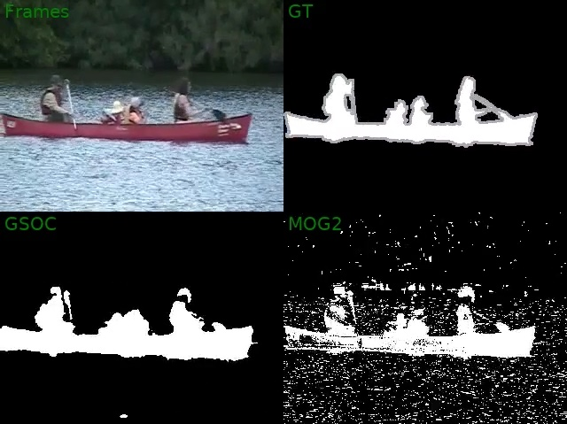

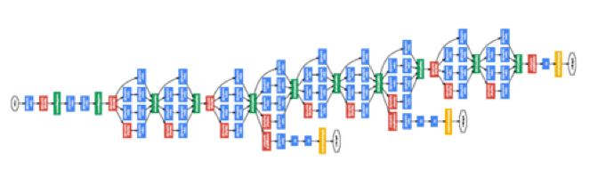

opencv_dnn has been further improved and extended:

-   Added faster R-CNN support and the corresponding [example](https://github.com/opencv/opencv/blob/master/samples/dnn/faster_rcnn.cpp).

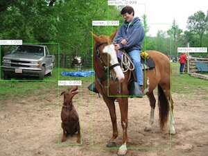

-   Javascript bindings have been extended to cover DNN module. See the corresponding [tutorial](https://docs.opencv.org/master/d5/d86/tutorial_dnn_javascript.html)
-   Also, DNN has been further accelerated for iGPU using OpenCL. Big thanks to Peng Li and his team for the contribution.


-   On-disk caching of precompiled OpenCL kernels has been finally implemented. It noticeably reduces initialization time of applications that use a lot of kernels.
-   Also, it's now possible to load and run pre-compiled OpenCL kernels via T-API. It can be useful on embedded platforms without OpenCL JIT compiler available. For details, see the following [guide](https://github.com/opencv/opencv/wiki/OpenCL-optimizations) on OpenCL acceleration in OpenCV.


-   Bit-exact 8-bit resize has been implemented (currently supported only bilinear interpolation and single-channel images). Use `INTER_LINEAR_EXACT` interpolation mode. In many places in the library we've switched to this new resize. `Bit-exact` means that on any platform with any compiler etc. you will get absolutely the same results for the same scale factor values, there will be no difference (even +/-1) in pixel values in the output image. The function complements a few other bit-exact algorithms added in OpenCV 3.3.1: `cvtColor(RGB<=>Lab, RGB<=>Luv)`.


-   Now the [reference guide](https://docs.opencv.org/master/) includes function/method prototypes for the Python bindings, e.g. type "convexHull" in the search field and you will see the C++ declaration and the Python wrapper spec below. That was another GSoC 2017 project. Big thanks to Cartucho and Vincent Rabaud. 
-   [Excellent tutorial](http://pullrequest.opencv.org/buildbot/export/pr/10304/docs/d9/dab/tutorial_homography.html) (TODO: update the  link) on how to compute and use homography matrix in OpenCV has been added. Big thanks to Catree.
-   [The guide](https://github.com/opencv/opencv/wiki/MediaSDK-encode-decode-backend) on how to use OpenCV with Intel Media SDK in order to get hardware-accelerated video decoding/encoding has been written by Maksim Shabunin.
-   [Another guide](https://github.com/opencv/opencv/wiki/Profiling-OpenCV-Applications) has been added a few months ago by Alexander Alekhin, but was not mentioned before, on how to profile OpenCV-based applications using Intel Tracing Technology tool.
-   Quite comprehensive set of [tutorials](https://docs.opencv.org/master/d5/d10/tutorial_js_root.html) on how to use OpenCV within a browser (via javascript bindings) has been created during GSoC 2017 


-   ~250 patches have been merged since OpenCV 3.3.1
-   over 200 issues have been closed

### Contributors

#### opencv

```
    86  Alexander Alekhin
    21  Maksim Shabunin
    18  Dmitry Kurtaev
    16  elenagvo
    11  Li Peng
     9  Vitaly Tuzov
     7  Suleyman TURKMEN
     6  Sayed Adel
     6  catree
     5  Vladislav Sovrasov
     5  Wu Zhiwen
     4  Pavel Rojtberg
     4  Vadim Pisarevsky
     4  Tomoaki Teshima
     4  LaurentBerger
     3  Rostislav Vasilikhin
     3  tribta
     2  Fakabbir Amin
     2  Bhanudutta
     2  Shinya Ishikawa
     2  dtmoodie
     2  Ryan Fox
     2  Mattia Rizzolo
     1  Nickola
     1  Pushkal Katara
     1  Riyuzakii
     1  Roman Cattaneo
     1  Shresth Verma
     1  Simon Guo
     1  Wei Hao
     1  Wu, Zhiwen
     1  alessandro faria
     1  berak
     1  gdkessler
     1  klchang
     1  woody.chow
     1  zhijackchen
     1  zhongwuzw
     1  Muhammad Abdullah
     1  Alexander Nesterov
     1  Amro
     1  Andrey Smorodov
     1  Arthur Pastel
     1  Cartucho
     1  Christof Kaufmann
     1  David Geldreich
     1  Elena Gvozdeva
     1  Florian Echtler
     1  Hamdi Sahloul
     1  Haritha
     1  Iago Suárez
     1  Igor Wodiany
     1  Ivan Pozdeev
     1  Jacob MacRitchie
     1  James Perkins
     1  Jcrist99
     1  Jonathan Viney
     1  Juha Reunanen
     1  KUANG Fangjun
     1  Mikhail Paulyshka
     1  Akhilesh Kumar
```

#### opencv_contrib

```
    20  sghoshcvc
    18  Vladislav Sovrasov
     6  Alexander Alekhin
     5  Hamdi Sahloul
     4  Suman Ghosh
     3  berak
     3  LaurentBerger
     2  Maksim Shabunin
     2  Pavel Rojtberg
     2  Suleyman TURKMEN
     1  kushalvyaskv
     1  Adam Gradzki
     1  sukhad-app
     1  Anup Parikh
     1  Egor Pugin
     1  Leonardo lontra
     1  Oleg Kalachev
     1  Vitaly Tuzov
     1  cDc
     1  fiammante
     1  klchang
     1  kurnianggoro
```

version:3.3.1
-------------

*October, 2017*

OpenCV 3.3.1 with extended dnn module, most of GSoC 2017 results integrated and other improvements has been released.


Results of several GSoC 2017 projects have been integrated:
  
  - multi-language (e.g. C++/Python/Java) tutorials by João Cartucho, mentored by Vincent Rabaud
  - AKAZE acceleration by Jiri Horner, mentored by Bence Magyar
  - End-to-end text detection and recognition by Suman Kumar Ghosh, mentored by Prasanna Krishnasamy


One of GSoC 2017 projects that deserves a dedicated section in the change log:

- Javascript interface to OpenCV (via Emscripten technology) and interactive Web-based OpenCV tutorials by Gang Song and Congxiang Pan. This small yet powerful team was supervised by Sajjad Taheri, Ningxin Hu and Mohammad R Haghighat. 


opencv_dnn has been further improved and extended; new samples have been added:

-   Face detection sample and the light-weight Resnet-10 + SSD based network have been added. See [the example](https://github.com/opencv/opencv/blob/master/samples/dnn/resnet_ssd_face_python.py) for details. The detector runs around 20-50FPS on a normal desktop/laptop, and the network is just 10MB (FP32) or even 5MB (FP16).

-   The partial Darknet parser, enough to parse YOLO models, as well as the layers to support a few variations of YOLO object detection networks have been integrated. See the corresponding [sample](https://github.com/opencv/opencv/blob/master/samples/dnn/yolo_object_detection.cpp).

-   Preliminary support for FP16 networks has been added. We do not do computations in FP16 yet, we convert FP16 coeffs to FP32 when loading the networks. In the case of Caffe we rely on the following [fork](https://github.com/NVIDIA/caffe), whereas in the case of TF we use the official version.

-   Several new layers have been added to support text detection, image colorization and some other networks.


-   OpenCV has been optimised for PPC64 (64-bit PowerPC) architecture by mapping the universal intrinsics to VSX. Big thanks to Sayed Adel for the patches.

-   OpenCL acceleration path of the bioinspired module has been restored. See the bioinspired-based HDR/Background segmentation [example](https://github.com/opencv/opencv_contrib/blob/master/modules/bioinspired/samples/retinaDemo.cpp). On Iris Pro HD5200 we get ~5x acceleration over the CPU branch.

-   KCF tracker has been accelerated by ~40%.


-   Hardware-accelerated video encoding/decoding via MediaSDK is now available on Windows too.

### Contributors

#### opencv

```
87  Alexander Alekhin
32  Dmitry Kurtaev
20  Vladislav Sovrasov
19  Rostislav Vasilikhin
19  tribta
14  Suleyman TURKMEN
10  saskatchewancatch
 9  Tomoaki Teshima
 8  Maksim Shabunin
 6  Ningxin Hu
 5  LaurentBerger
 5  berak
 4  Pavel Rojtberg
 4  Steven Puttemans
 4  Vitaly Tuzov
 3  Pavel Vlasov
 3  KUANG Fangjun
 3  Boris Fomitchev
 3  Igor Wodiany
 2  Ryan Fox
 2  Nishant Arora
 2  Emanuele Ruffaldi
 2  Wu Zhiwen
 2  Tony0
 2  RAJ NATARAJAN
 2  Adi Shavit
 2  Christof Kaufmann
 2  Aleksandr Rybnikov
 2  Sayed Adel
 2  stalin18
 2  Jiri Horner
 2  Jasper Shemilt
 2  Zoltán Mizsei
 2  blendin
 1  Ricardo Ribalda Delgado
 1  Sayan Sinha
 1  Sebastian Höffner
 1  Sergey Alexandrov
 1  Vivek Wisdom
 1  Vladislav Vinogradov
 1  Woody Chow
 1  Yaron Inger
 1  bradford barr
 1  catree
 1  jodrescher
 1  joncrall
 1  jrobble
 1  lzx1413
 1  mevatron
 1  pengli
 1  tz70s
 1  vipinanand4
 1  678098
 1  woody.chow
 1  Adam Rankin
 1  Alex Zatsman
 1  AlexeyAB
 1  Arvid Piehl Lauritsen Böttiger
 1  Balint Cristian
 1  Benoit Blanchon
 1  Bisaloo
 1  Camille Barneaud
 1  Congxiang Pan
 1  David Geldreich
 1  Deric Crago
 1  Faheel Ahmad
 1  Geoff McIver
 1  Gregory Morse
 1  Guillaume Jacob
 1  James Perkins
 1  Jeremy Maitin-Shepard
 1  John Hany
 1  KUANG, Fangjun
 1  Kerry Billingham
 1  Khem Raj
 1  Kim Lindberg Schwaner
 1  Lewis B
 1  Li Peng
 1  Maarten de Vries
 1  Martin Seyferth
 1  Mattia Rizzolo
 1  Patel, Nilaykumar K
 1  Peter Fischer
 1  Peter J. Stieber
 1  Philipp Hasper
 1  Pranit Bauva
 1  Raymond Kirk
```

#### opencv_contrib

```
19  Alexander Alekhin
19  Vladislav Sovrasov
13  Anguelos Nicolaou
 4  Suleyman TURKMEN
 3  Vitaly Tuzov
 3  acyen
 3  jaco
 2  Woody Chow
 2  Maksim Shabunin
 2  LaurentBerger
 2  Andrew Hundt
 2  Fernando Martin
 1  baudenri
 1  f3rm4rf3r
 1  jasjuang
 1  jrobble
 1  klchang
 1  Ahmed Yarub Hani
 1  woody.chow
 1  Albert
 1  Cristian Duguet
 1  Dmitry Kurtaev
 1  Felix Wehnert
 1  Francis Charette Migneault
 1  Gregor Kovalčík
 1  Jaykob
 1  Linus Ericsson
 1  Nuzhny007
 1  Piotr Majkrzak
 1  atinfinity
```

version:3.3
-----------

*August, 2017*

OpenCV 3.3 with accelerated dnn module, moved to the main repository, first-ever appearance of
Halide in OpenCV, multiple optimizations and other improvements has been released.


opencv_dnn module has been moved from the contribution repository (opencv_contrib) to the main
repository (opencv) and was significantly improved:

-   High-level API has been modified and is even more convenient now.

-   The regression tests have been expanded, some new tests have been added. Now, there are 46 of them.

-   Many bugs have been fixed in Torch and TF loaders, as well as in some processing layers. Now we check that on a certain set of networks the results from OpenCV DNN match or very close to the results from the original frameworks. We also check that the results claimed in the papers for such networks are achievable with OpenCV DNN.

-   Performance has been substantially improved. Layer fusion has been implemented and some performance-critical layers have been optimized using AVX, AVX2, SSE and NEON. An external BLAS (OpenBLAS, MKL, ATLAS) is not needed anymore.

-   New [samples](https://github.com/opencv/opencv/tree/master/samples/dnn) in C++ and Python have been added.

-   The optional [Halide](http://halide-lang.org) backend has been added. It can accelerate OpenCV DNN on GPU when the GPU is fast enough.

    See [Deep Learning in OpenCV](https://github.com/opencv/opencv/wiki/Deep-Learning-in-OpenCV)
    for details about the module.


-   Upgraded IPPICV from 2015.12 to 2017.2 version brought ~15% speed improvement into core and imgproc modules (measured as geometrical mean over the corresponding performance tests).


-   Dynamic dispatching of SSE4.2/AVX/AVX2 code has been implemented. Previously, OpenCV had to be built with SSE4.x/AVX/AVX2 turned on in order to use such optimizations and that made it incompatible with older hardware. Now the OpenCV binaries automatically adapt to the real hardware and make use of new instructions if they are available while retaining compatibility with older hardware. All the existing AVX/AVX2 optimizations in OpenCV have been refactored to use this technology. AVX acceleration of DNN also uses dynamic dispatching.


-   OpenCV can now be configured and built as C++ 11 library. Pass `-DENABLE_CXX11=ON` to CMake. On some modern Linux distributions, like the latest Fedora, it’s enabled by default.

-   New features for C++ 11 users have been added:

    ```.cpp
    // 1. use parallel_for_ with lambda to compute Mandelbrot fractal
    parallel_for_(Range(0, img.rows*img.cols), [&](const Range& r) {
        for (int r = r.start; r < r.end; r++) {
            int i = r/img.cols, j = r%img.cols, t, maxiter=500;
            complex<float> z0(j * 2.7f/img.cols – 2.1f,
                              i * 2.4f/img.rows – 1.2f);
            for (t = 0; t < maxiter; t++) {
                if (z.real()*z.real()+z.imag()*z.imag()> 4.f) break;
                z = z*z + z0;
            }
            img.at<uchar>(i, j)=uchar(sqrt((float)t/maxiter)*255);
    }});

    // 2. using C++ 11 initializers
    auto A = Mat_<double>({0, -1, 0, -1, 5, -1, 0, -1, 0}).reshape(1, 3);
    Vec_<int, 10> digits = {0, 1, 2, 3, 4, 5, 6, 7, 8, 9};

    // 3. apply LUT to 8-bit image in C++ 11 style
    Mat_<Vec3b> img = imread("lena.jpg");
    for( auto& pixel: img ) {
        pixel[0] = gamma_lut[pixel[0]];
        pixel[1] = gamma_lut[pixel[1]];
        pixel[2] = gamma_lut[pixel[2]];
    }
    ```


-   Support for hardware-accelerated video encoding/decoding using Intel GPUs through Intel Media SDK has been implemented for Linux (in the form of backends for `cv::VideoCapture` and `cv::VideoWriter`).

    -   Encoding and decoding of raw H.264 and MPEG1/2 video streams is supported, media containers are not supported yet.

    -   Note that system kernel should have specific support for hardware as mentioned in the [Media SDK/Server Studio installation         guide](https://software.intel.com/en-us/articles/how-to-setup-media-server-studio-on-secondary-os-of-linux). In some cases kernel recompilation will be needed.

    -   See also: [https://github.com/Intel-Media-SDK](https://github.com/Intel-Media-SDK)

### Contributors

#### opencv

```
210	Alexander Alekhin
 36	Vladislav Sovrasov
 35	Tomoaki Teshima
 31	Vitaly Tuzov
 26	Maksim Shabunin
 21	Fangjun KUANG
 17	chacha21
 14	LaurentBerger
 12	berak
 11	Rostislav Vasilikhin
 11	catree
 10	dkurt
  8	Matthias Grundmann
  8	Pavel Rojtberg
  8	Pyotr Chekmaryov
  8	Vadim Pisarevsky
  8	Woody Chow
  7	Aleksandr Rybnikov
  7	atinfinity
  6	Hamdi Sahloul
  6	vskarlsruhe
  5	Jiri Horner
  5	KUANG, Fangjun
  5	Michele Cancilla
  5	StevenPuttemans
  4	Dal Rupnik
  4	Naba Kumar
  4	Pavel Vlasov
  4	chrizandr
  4	saskatchewancatch
  3	Claudio
  3	Jaime O. Rios
  3	Peter Würtz
  3	PkLab.net
  3	Suleyman TURKMEN
  3	Wenju He
  3	Yuriy Solovyov
  3	abratchik
  3	nnorwitz
  3	oulenz
  2	Alexander Broemmer
  2	Artem Lukoyanov
  2	Chaoshuai Lu
  2	Drew Hintz
  2	Kerry Billingham
  2	LukeZhu
  2	Matt Bennett
  2	Philipp Hasper
  2	Rink Springer
  2	Sergiu Deitsch
  2	Tetragramm
  2	Tong Ke
  2	Utkarsh Sinha
  2	jveitchmichaelis
  2	lewisjb
  2	mshabunin
  2	tribta
  2	utibenkei
  2	ville-v
  2	ziggy90127
  1	Adeel
  1	Adeel Ahmad
  1	Alessandro Gentilini
  1	Alexander Duda
  1	Amro
  1	André Mewes
  1	Anupam Sobti
  1	Arek
  1	Arkadiusz Raj
  1	Arnaud Brejeon
  1	BadrinathS
  1	Bragadeesh
  1	Brian Armstrong
  1	Bryce Evans
  1	Cartucho
  1	Christof Kaufmann
  1	David Carlier
  1	Dinar
  1	Dinar Ahmatnurov
  1	Dmitry Kurtaev
  1	Duncan Barber
  1	Egor Pugin
  1	Fernando Iglesias Garcia
  1	Frank de Brabander
  1	Gabriel B. Nunes
  1	Guilherme William Guedes
  1	Hans Gaiser
  1	Ilija Puaca
  1	Ismo Puustinen
  1	James Clarke
  1	Jejos
  1	Jeremy Maitin-Shepard
  1	Jinay Patel
  1	Jiří Sejkora
  1	Jon Eyolfson
  1	Jose Gómez
  1	Juha Reunanen
  1	Julian Exner
  1	Julian Tanke
  1	Kene Udeh
  1	Kuan-Yi Li
  1	Kyle Fleming
  1	Lorena García
  1	Louie Helm
  1	Mark Szumowski
  1	Martin Ganeff
  1	Neil Shipp
  1	Neio Zhou
  1	Nicholas Nadeau
  1	Ninad P.Chaudhari
  1	Paolo Perkovic
  1	Pascal Thomet
  1	Patrik Huber
  1	Piotr Semenov
  1	PkLab
  1	Raj Natarajan
  1	Robert Bragg
  1	Robin Chavignat
  1	Ryan Pavlik
  1	Ryuhei Mori
  1	Sadika Sumanapala
  1	Satoshi Tanaka
  1	Sergey
  1	Shuyu Liang
  1	Sixela David
  1	Steve
  1	Steven Puttemans
  1	Tim King
  1	Tony Lian
  1	Tony Theodore
  1	Vadzim Piatrou
  1	Werner Palfinger
  1	Yakun Wang
  1	Yuval Langer
  1	Zhiwei Su
  1	brian-armstrong-discord
  1	cDc
  1	cclauss
  1	daB0bby
  1	gylns
  1	hailong-wang
  1	huangqinjin
  1	insoow
  1	ionut
  1	jexner
  1	jqly
  1	krishraghuram
  1	kvaghel1
  1	likan999
  1	logic1988
  1	mrquorr
  1	mschoeneck
  1	msk-repo01
  1	n001519
  1	neok-m4700
  1	orisano
  1	puqeko
  1	q
  1	remi
  1	rmensing
  1	sovrasov
  1	umbraclet16
  1	vartenkov
  1	wykvictor
  1	wzw
  1	xuning0
  1	ylemkimon
  1	zongwave
```

#### opencv_contrib

```
44	Vladislav Sovrasov
24	Alexander Alekhin
14	Aleksandr Rybnikov
11	Hamdi Sahloul
11	dkurt
 9	Vadim Pisarevsky
 7	berak
 6	LaurentBerger
 5	Maksim Shabunin
 4	Balint Cristian
 4	arrybn
 3	Dmitry Kurtaev
 3	Li Peng
 3	Pavel Rojtberg
 3	Pavel Vlasanek
 3	Philipp Hasper
 3	Suleyman TURKMEN
 3	jexner
 2	Kumataro
 2	Steven Puttemans
 2	Vladislav Samsonov
 2	Woody Chow
 2	atinfinity
 2	lhelontra
 2	mshabunin
 2	np-csu
 2	olivierpascal
 1	Diego
 1	Edgar Riba
 1	Erik Sandrén
 1	Erwan Normand
 1	Haaris
 1	Jcrist99
 1	Jeremy Nicola
 1	Julian Exner
 1	Justin Hotchkiss Palermo
 1	Kiran Pradeep
 1	Leonardo lontra
 1	Lorena García
 1	Max-Wang
 1	Natsuki Kawai
 1	Rostislav Vasilikhin
 1	Sergey
 1	StevenPuttemans
 1	Tham
 1	Yorwba
 1	Yuriy Obukh
 1	abratchik
 1	catree
 1	goldstar616
 1	logic1988
 1	nyanp
 1	oqtvs
 1	saskatchewancatch
 1	szk1509
 1	utibenkei
```


version:3.2
-----------

*December, 2016*

Long-awaited update to OpenCV 3.x release series, with tons of improvements and bug fixes. Big
thanks to everyone who particpated! If you contributed something but your name is missing, please,
let us know.


-   Results from 11 GSoC 2016 projects have been submitted to the library, 9 of them have been integrated already, 2 still pending (the numbers below are the id’s of the Pull Requests in opencv or opencv_contrib repository):
    -   Ambroise Moreau (Delia Passalacqua) – sinusoidal patterns for structured light and phase unwrapping module (711)
    -   Alexander Bokov (Maksim Shabunin) – DIS optical flow (excellent dense optical flow algorithm that is both significantly better and significantly faster than Farneback’s algorithm – our baseline), and learning-based color constancy algorithms implementation (689, 708, 722, 736, 745, 747)
    -   Tyan Vladimir (Antonella Cascitelli) – CNN based tracking algorithm (GOTURN) (718, 899)
    -   Vladislav Samsonov (Ethan Rublee) – PCAFlow and Global Patch Collider algorithms implementation (710, 752)
    -   João Cartucho (Vincent Rabaud) – Multi-language OpenCV Tutorials in Python, C++ and Java (7041)
    -   Jiri Horner (Bo Li) – New camera model and parallel processing for stitching pipeline (6933)
    -   Vitaliy Lyudvichenko (Anatoly Baksheev) – Optimizations and improvements of dnn module (707, 750)
    -   Iric Wu (Vadim Pisarevsky) – Base64 and JSON support for file storage (6697, 6949, 7088). Use names like `“myfilestorage.xml?base64”` when writing file storage to store big chunks of numerical data in base64-encoded form.
    -   Edgar Riba (Manuele Tamburrano, Stefano Fabri) – tiny_dnn improvements and integration (720: pending)
    -   Yida Wang (Manuele Tamburrano, Stefano Fabri) – Quantization and semantic saliency detection with tiny_dnn
    -   Anguelos Nicolaou (Lluis Gomez) – Word-spotting CNN based algorithm (761: pending)

    big thanks to all the participants!


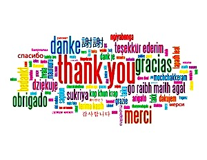

-   There have been many contributions besides GSoC (big thanks to the authors, which names/nicknames are enclosed in parentheses):
    -   DICOM support via GDCM library (look4pritam), PAM format support (DmtKats)
    -   Support GigE cameras via Aravis SDK (thanks to ArkadiuszRaj)
    -   Interactive camera calibration app, see https://github.com/opencv/opencv/tree/master/apps/interactive-calibration, and QR matrix decomposition (Vlad Sovrasov)
    -   OpenCL accelerations exposed to Python (Nikolay Polyarniy)
    -   Instrumentation framework for performance testing (Pavel Vlasov)
    -   Many improvements in tests (Maksim Shabunin, Alexander Alekhin and many other people)
    -   Weighted median filter (Zhou Chao)
    -   VGG descriptor, BoostDesc descriptor (Balint Cristian)
    -   Selective search segmentation (Maximilien Cuony)
    -   Paillou and Deriche Filter (Laurent Berger)
    -   Bilateral texture filter (jhlee525)
    -   BIF descriptor (Alexey Spizhevoy)
    -   BM3D noise reduction (Bartek Pawlik)
    -   Fine Grained Saliency (Sebastian Montabone)
    -   Position-Color-Texture signatures extractor (Gregor Kovalčík)
    -   Thinning algorithms (Steven Puttemans)
    -   Fast Line Detector (Jin Han Lee)
    -   Freetype2 support (@Kumataro)
    -   etc.


-   A lot of improvements have been done in our dnn module (https://github.com/opencv/opencv_contrib/tree/master/modules/dnn):
    -   The module has been expanded (in particular, LSTM and many other layers have been added) and refactored to support OpenCL acceleration (which is temporarily disabled) (Vitaly Lyudvichenko)
    -   External BLAS implementations are detected and used to accelerate convolutions (Vitaly Lyudvichenko)
    -   Added semantic segmentation support + sample, see https://github.com/opencv/opencv_contrib/blob/master/modules/dnn/samples/fcn_semsegm.cpp (Vladimir Bystricky)
    -   Single Shot MultiBox Detector: added missing layers + sample, see https://github.com/opencv/opencv_contrib/blob/master/modules/dnn/samples/ssd_object_detection.cpp (Anna Petrovicheva)
    -   Added importer of TensorFlow models + sample; see https://github.com/opencv/opencv_contrib/blob/master/modules/dnn/samples/tf_inception.cpp (Alexander Rybnikov)


-   There are also many updates to make sure that OpenCV compiles and runs on modern OSes with modern compilers:
    -   Ubuntu 16.04 LTS with GCC 5.×. GCC 6.x is supported too.
    -   OSX 10.11 – 10.12 with XCode 8.x; in particular, we now use the new AVFoundation backend on OSX. Thanks to yoffy, Matthew Self and Ryan Govostes.
    -   Visual Studio 2015; VS 2017 will likely work too.
    -   Better support for AArch64 on Linux and Android

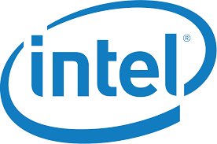

-   Intel MKL can now be used to accelerate SVD, LU, camera calibration, as well as DNN module.
-   Added initial support for Intel Compiler (Intel Compiler 2017 has been tested on Windows and Linux)
-   Many SSE optimizations have been done; big thanks to K-Shinotsuka, Tomoaki Teshima, mschoeneck and many other people.
-   Several OpenCL kernels, specially optimized for Intel GPUs, have been contributed by Peng Li and others.


-   NVidia corporation has donated ARM optimizations for OpenCV, the Carotene library (https://github.com/opencv/opencv/tree/master/3rdparty/carotene).
-   CUDA 8 is now supported.
-   There is also the new tutorial on installing OpenCV on Tegra platforms by Randy J. Ray: http://docs.opencv.org/master/d6/d15/tutorial_building_tegra_cuda.html, which could probably be useful for other mobile platforms running Linux as well.


 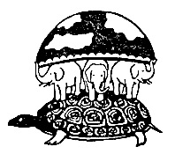

-   OpenVX 1.x implementations can now be used to accelerate OpenCV, mostly through the HAL mechanism. Build OpenCV with WITH_OPENVX flag turned on and specifty where to find OpenVX (see https://github.com/opencv/opencv/blob/master/cmake/FindOpenVX.cmake for details).
-   Convenient C++ wrappers for OpenVX that simplify joint use of OpenCV + OpenVX have been created by Andrey Pavlenko. See the examples at https://github.com/opencv/opencv/tree/master/samples/openvx, the wrappers are in ivx.hpp header.
-   External BLAS+Lapack implementations (such as MKL, OpenBLAS, Atlas or Apple’s Accelerate framework) can now be used to accelerate SVD decomposition, LU decomposition etc.
-   HAL has been extended to support much more functions such as image warping, color conversion, filtering operations.


-   This release features a record number of PRs and bug fixed:
    -   778 + 191 PRs merged into opencv + opencv_contrib master since 3.1.0
    -   348 bugs and 69 features in opencv master
    -   47 bugs and 14 features in opencv_contrib

### Contributors

#### opencv

    git shortlog --no-merges -ns 3.1.0..3.2.0
       244  Alexander Alekhin
        63  Vitaly Tuzov
        57  Tomoaki Teshima
        54  Maksim Shabunin
        51  Vladislav Sovrasov
        46  Ilya Lavrenov
        40  Rostislav Vasilikhin
        33  k-shinotsuka
        30  StevenPuttemans
        29  Pavel Rojtberg
        24  MYLS
        18  Marina Noskova
        17  catree
        15  Alexander Smorkalov
        14  Suleyman TURKMEN
        13  Vladislav Vinogradov
        13  apavlenko
        13  berak
        12  Alexandr Kondratev
        11  mshabunin
        10  Dan
        10  Pavel Vlasov
        10  Valeriy Van
        10  atinfinity
        10  matze
         9  Li Peng
         9  abratchik
         8  Roman Donchenko
         8  Vadim Pisarevsky
         7  Aleksandar Atanasov
         7  Philipp Hasper
         6  ArkadiuszRaj
         6  Francisco Facioni
         6  LaurentBerger
         6  PkLab.net
         6  sourin
         5  E Sommerlade
         5  Eric Zavesky
         5  Ishank gulati
         5  Matthew Self
         5  Philip
         5  Tetragramm
         4  Amro
         4  Andrey Pavlenko
         4  Arthur Cinader
         4  Christoph Spörk
         4  Dikay900
         4  Marian Zajko
         4  alcinos
         4  daB0bby
         4  filipsladek
         4  ohnozzy
         3  Alexander Karsakov
         3  Andreas Franek
         3  Arek
         3  Arkadiusz Raj
         3  Dimitrios Katsaros
         3  Eric Sommerlade
         3  Gilles Rochefort
         3  Juha Reunanen
         3  Marek Smigielski
         3  Mathieu Barnachon
         3  Matthew Skolaut
         3  Philippe FOUBERT
         3  Sergei Nosov
         3  Vitaliy Lyudvichenko
         3  Your Name
         3  a-andre
         3  anirudt
         3  aravind
         3  kurenai
         3  panxiaochun
         3  shruthikashyap
         3  thierry
         3  will hunt
         3  Прун Виктор
         2  Addison Elliott
         2  Alexander Shishkov
         2  Anatoly Orlov
         2  Asal Mirzaieva
         2  Bleach666
         2  Bob Paulin
         2  Cartucho
         2  Dan Moodie
         2  David Wolever
         2  Declan Moran
         2  Dmitry Trifonov
         2  DozyC
         2  Elad Joseph
         2  Elif Albuz
         2  Eric Liao
         2  Erich Keane
         2  Hajo Nils Krabbenhöft
         2  Hannes
         2  Jan Starzynski
         2  Joe Howse
         2  Jose Luis Guardiola
         2  Josh Lubawy
         2  Lucas Solomon
         2  Naba Kumar
         2  Patrick Snape
         2  Patrik Huber
         2  Peter Rekdal Sunde
         2  Piotr Semenov
         2  Quentin
         2  Randy J. Ray
         2  Robbert Klarenbeek
         2  Rok Mandeljc
         2  Sean McBride
         2  Sergiu Deitsch
         2  Steven Puttemans
         2  Susmit
         2  Teng Cao
         2  emiswelt
         2  jiakai
         2  lewgate
         2  mschoeneck
         2  shengyu
         2  takacsd
         1  Aaron Simmons
         1  Adam Rankin
         1  Alexander Fedorov
         1  AlexeyAB
         1  Ankit Yadav
         1  Anton V. Shokurov
         1  Anush Elangovan
         1  Artyom Lebedev
         1  Balint Cristian
         1  Bernd Kuhls
         1  BinMatrix
         1  Bleach
         1  Bram Ton
         1  CSBVision
         1  Christian Kapeller
         1  Colin Finck
         1  Dmitry Mozgin
         1  Dmitry-Me
         1  Dustin Spicuzza
         1  Eduardo Arnold
         1  Elena Gvozdeva
         1  Elena Shipunova
         1  Emanuel Jöbstl
         1  Eugene Khvedchenya
         1  Evan Heidtmann
         1  Feng Zhoutian
         1  Finfa811
         1  Fraser Harris
         1  Graham Fyffe
         1  Gregory Kramida
         1  Gregory Morse
         1  Guillaume Jacob
         1  Guy Sheffer
         1  HMM@T430s-x64
         1  Han Hu
         1  Ian MacLeod
         1  Ivar Clemens
         1  JR Heard
         1  Jake Kesinger
         1  Jason von Nieda
         1  Jcrist99
         1  Jeff McBride
         1  Jeroen Kromwijk
         1  Jiri Horner
         1  Josep Bosch
         1  Juan Pablo Aveggio
         1  Julien Dehos
         1  Julien Dubiel
         1  Julien Nabet
         1  Kai Hugo Hustoft Endresen
         1  Kerry Billingham
         1  Kevin Hughes
         1  Kevin, Hu
         1  KeySecure
         1  Kotrix
         1  Krishnaraj Bhat
         1  Leonardo Brás
         1  Leonid Volnitsky
         1  Louis Letourneau
         1  Luis Roberto Morales Iglesias
         1  LukeZhu
         1  Matt Leotta
         1  Matthew Cook
         1  Matthieu FT
         1  Matěj Šmíd
         1  Michael Shtutman
         1  Morrison
         1  Nikolay Polyarniy
         1  Noel Eck
         1  Oded Green
         1  Oliver Schreer
         1  Oskari Vinko
         1  Patrick Spettel
         1  Peter Entwistle
         1  Philipp Nordhus
         1  Philippe Renon
         1  Pierre Dulac
         1  Pranav Ganorkar
         1  Prayag Verma
         1  Péter Trombitás
         1  Rahul Chhabra
         1  S. Garrido
         1  Sean Li
         1  Sergey Alexandrov
         1  Simmo Saan
         1  Simon Hänisch
         1  Sovrasov
         1  Stephane Thiell
         1  Steven E Wright
         1  Tauranis
         1  Thierry Fauck
         1  Thomas Schenker
         1  Tomi
         1  Tsukasa Sugiura
         1  Vadzim Piatrou
         1  Vincent Rabaud
         1  WANG Guoqin
         1  Xiaolei Yu
         1  Zhenqing, Hu
         1  Zhigang Gong
         1  ahb
         1  arybnikov
         1  bedbad
         1  chacha21
         1  danil-tolkachev
         1  debjan
         1  dharezlak
         1  fegorsch
         1  ggargov
         1  guoxuedong
         1  jacobdang
         1  joao.faro
         1  logic1988
         1  look4pritam
         1  monoid911
         1  mpkh
         1  mrquorr
         1  mvukad
         1  parismita
         1  qiao
         1  renu285
         1  rishirajsurti
         1  robertxwu
         1  sarthak
         1  solosuper
         1  stbnps
         1  themightyoarfish
         1  viodetools
         1  yigitsoy
         1  yoffy
         1  Özgür Can

#### opencv_contrib

    git shortlog --no-merges -ns 3.1.0..3.2.0
        43  Vitaliy Lyudvichenko
        30  Alexander Alekhin
        29  Anna Petrovicheva
        25  Vladislav Samsonov
        25  Vladislav Sovrasov
        21  Gary Bradski
        15  Pavel Rojtberg
        12  berak
        10  Balint Cristian
         5  Maksim Shabunin
         5  Suleyman TURKMEN
         5  apetrovichev
         5  lluisgomez
         4  Alexander Bokov
         4  Amro
         4  StevenPuttemans
         4  mshabunin
         3  Jinhan Lee
         3  Patrick Snape
         3  Rok Mandeljc
         3  Steve Nicholson
         3  folz
         3  vbystricky
         2  LaurentBerger
         2  Maximilien Cuony
         2  Prof. Dr. Rudolf Haussmann
         2  Vadim Pisarevsky
         2  Vitaly Tuzov
         2  Yuki Furuta
         2  catree
         2  sbokov
         1  Aleksandr Rybnikov
         1  Alexey Spizhevoy
         1  AmbroiseMoreau
         1  Amy Winston
         1  Andrea Merello
         1  Bartek Pawlik
         1  Bleach
         1  Bleach666
         1  Christian Richardt
         1  Daniel Ching
         1  Dikay900
         1  Eric Zavesky
         1  Eugene Mamin
         1  Geoff
         1  Gregor Kovalcik
         1  Gregory Kramida
         1  Gunshi Gupta
         1  Han Hu
         1  Konstantin Volokh
         1  Kotrix
         1  Kumataro
         1  Lorena García
         1  MambaWong
         1  Marek Smigielski
         1  Martin Nowak
         1  Minh Ngo
         1  Nicu Stiurca
         1  Pavel Vlasanek
         1  Rostislav Vasilikhin
         1  Sarthak Ahuja
         1  Sunglok Choi
         1  Thomas Schulz
         1  VBystricky
         1  Vasilikhin
         1  Vladimir
         1  Wu Jiang
         1  Zhou Chao
         1  abratchik
         1  alessiodore
         1  andrewk-mccann
         1  aravind
         1  baisheng lai
         1  comdiv
         1  damir
         1  edgarriba
         1  jasjuang
         1  jhlee525
         1  lukaszi89
         1  lych77
         1  samontab
         1  sht3ch
         1  tharunkalwa


version:3.1
-----------

*December, 2015*

This is the first stabilization update in 3.x series. It shall be reminded that since OpenCV 3.0
we’ve changed the version enumeration scheme, so that 3.1 is the same sort of update to 3.0 as 2.4.1
was to 2.4.0.


-   There have been many successful projects this year (student and mentor(s) are listed after the project name), and the results are available as a part of OpenCV 3.1 (partially in the main repository, but mostly opencv_contrib):
    -   **Omnidirectional Cameras Calibration and Stereo 3D Reconstruction** – opencv_contrib/ccalib module (Baisheng Lai, Bo Li)
    -   **Structure From Motion** – opencv_contrib/sfm module (Edgar Riba, Vincent Rabaud)
    -   **Improved Deformable Part-based Models** – opencv_contrib/dpm module (Jiaolong Xu, Bence Magyar)
    -   **Real-time Multi-object Tracking using Kernelized Correlation Filter** – opencv_contrib/tracking module (Laksono Kurnianggoro, Fernando J. Iglesias Garcia)
    -   **Improved and expanded Scene Text Detection** – opencv_contrib/text module (Lluis Gomez, Vadim Pisarevsky)
    -   **Stereo correspondence improvements** – opencv_contrib/stereo module (Mircea Paul Muresan, Sergei Nosov)
    -   **Structured-Light System Calibration** – opencv_contrib/structured_light (Roberta Ravanelli, Delia Passalacqua, Stefano Fabri, Claudia Rapuano)
    -   **Chessboard+ArUco for camera calibration** – opencv_contrib/aruco (Sergio Garrido, Prasanna, Gary Bradski)
    -   **Implementation of universal interface for deep neural network frameworks** – opencv_contrib/dnn module (Vitaliy Lyudvichenko, Anatoly Baksheev)
    -   **Recent advances in edge-aware filtering, improved SGBM stereo algorithm** – opencv/calib3d and opencv_contrib/ximgproc (Alexander Bokov, Maksim Shabunin)
    -   **Improved ICF detector, waldboost implementation** – opencv_contrib/xobjdetect (Vlad Shakhuro, Alexander Bovyrin)
    -   **Multi-target TLD tracking** – opencv_contrib/tracking module (Vladimir Tyan, Antonella Cascitelli)
    -   **3D pose estimation using CNNs** – opencv_contrib/cnn_3dobj (Yida Wang, Manuele Tamburrano, Stefano Fabri)


-   Besides GSoC, we have multiple contributions from the community; below is the partial list of contributed functionality:
    -   plot module – Nuno Moutinho
    -   ni-black thresholding algorithm – ximgproc, Samyak Datta
    -   Superpixel segmentation using Linear Spectral Clustering, SLIC superpixels – ximgproc, Balint Cristian
    -   HDF (HDF5) support module – Balint Cristian
    -   Depth to external RGB camera registration – rgbd, Pat O’Keefe
    -   Computing normals for a point cloud – rgbd, Félix Martel-Denis
    -   Fuzzy image processing module – Pavel Vlasanek
    -   Rolling guidance filter – ximgproc, Zhou Chao
    -   3x faster SimpleFlow – optflow, Francisco Facioni
    -   Code and docs for CVPR 15’ paper “DNNs are easily fooled” – Anh Nguyen
    -   Efficient Graph-based image segmentation algorithm – ximgproc, Maximilien Cuony
    -   Sparse-to-dense optical flow – optflow, Sergey Bokov
    -   Unscented Kalman Filter (UKF) and Augmented UKF – tracking, Svetlana Filicheva
    -   Fast Hough Transform – ximgproc, xolodilnik
    -   Improved performance of haartraining – Teng Cao
    -   Python samples made compatible with Python 3 – bastelflp


-   The iOS framework (opencv2.framework) can now be configured to include both opencv and opencv_contrib functionality. Previously, there were 2 separate frameworks, but because of the include directory names (“opencv2/…”, regardless of whether some module is from opencv or from opencv_contrib), the produced opencv_contrib was unusable.


-   more efficient camera support on Android 5+
-   faster round() on ARM (it’s also applicable to iOS); big thanks to Manuele Tamburano and Stefano Fabri for this!

 

-   OpenCV 3.1 supports fresh OSes from Microsoft and Apple, as well as the newest development tools (VS2015 and Xcode 7, respectively).


-   IPPICV (a specially-for-opencv free-of-charge subset of IPP (https://software.intel.com/en-us/intel-ipp) that has been kindly provided by Intel Corporation) is now based on IPP 9.0.1, which should make OpenCV even faster on modern Intel chips.


-   There are multiple new features in the OpenCL layer, resulted from our collaboration with Intel Corporation
    -   Improved/extended interoperability with DirectX 9, 10, 11. That includes conversions between DX Surface and UMat, with number of copying operations reduced where possible. See opencv/samples/directx.
    -   Interoperability with Video Acceleration API on Linux. This feature requires Intel Media Server Studio (https://software.intel.com/en-us/intel-media-server-studio/try-buy) and uses Intel’s cl_intel_va_api_media_sharing extension to OpenCL. See opencv/samples/va_intel
    -   OpenCL&lt;=&gt;OpenGL interoperability via cl_khr_gl_sharing extension. It’s possible now to convert OpenGL textures and OpenGL buffers to/from UMat. See opencv/samples/opengl.
    -   OpenCL&lt;=&gt;OpenCL interoperability. It means, people can now use OpenCL-accelerated OpenCV together with their custom OpenCL code and/or other OpenCL libraries. See opencv/samples/opencl for details.
    -   Support for Camera2 API in Android 5+. See opencv/samples/android/tutorial-4-opencl, the tutorial that demonstrates 3 ways of processing data from camera:
        -   purely CPU pipeline (3-4 fps on our test device)
        -   OpenCV-based using UMat and transparent API (10-13 fps on the same device)
        -   direct use of OpenCL (28-30fps). This is the fastest method, as you can see, because it uses OpenCL images, whereas more universal T-API has to use OpenCL buffers.


-   HAL (Hardware Acceleration Layer), as a separate OpenCV module, opencv_hal, lived a short yet a bright life; we decided to split it by parts and move the parts into the respective regular OpenCV modules (core, imgproc etc.). It will help us to keep the dependency graph clean and sane.
-   Added 2 examples (see opencv/samples/hal) on how to provide external accelerated versions of the HAL functions; note that an external implementation does not have to implement all of the HAL. The supplied README explains how to build the custom HAL accelerator, and how to build OpenCV with such a custom HAL replacement: https://github.com/opencv/opencv/tree/master/samples/hal
-   Added some more few functions to the HAL (arithmetic operations, split, merge); much more to come in OpenCV 3.2


-   Over 420 pull requests to opencv and over 100 pull requests to opencv_contrib have been merged in since 3.0.0. Big thanks to all the people who submitted bug fixes, new functionality and other small and big improvements! Special thanks goes to all the GSoC 2015 students and mentors, who created a lot of great functionality!

### Contributors

#### opencv

    git shortlog --no-merges -ns 3.0.0..3.1.0
       146  Vladislav Vinogradov
       109  Alexander Alekhin
       103  Alexander Smorkalov
        73  Maksim Shabunin
        68  Ilya Lavrenov
        48  Roman Donchenko
        47  StevenPuttemans
        45  Pavel Rojtberg
        28  Andrey Pavlenko
        25  Seon-Wook Park
        20  Pavel Vlasov
        20  Suleyman TURKMEN
        18  Viet Dinh
        17  Alexey Ershov
        15  berak
        14  Vladimir Dudnik
        13  Artur Wieczorek
        12  Dan
        12  Lorena García
        10  Dikay900
        10  ippei ito
         9  Mansour Moufid
         8  E Braun
         8  Grigory Serebryakov
         7  Alexander Karsakov
         7  Alexander Nitsch
         7  Vadim Pisarevsky
         7  Vijay Pradeep
         6  LaurentBerger
         6  Marian Zajko
         6  Nguyen Nguyen
         6  Philipp Hasper
         6  flp
         6  sbokov
         5  Andreas Stührk
         5  PhilLab
         5  Rok Mandeljc
         5  Ruslan Baratov
         5  askourik
         5  songyuncen
         4  Abe Friesen
         4  Aman Verma
         4  Dan Moodie
         4  Dinar Ahmatnurov
         4  Dominik Kleiser
         4  Elad Joseph
         4  Gleb Gladilov
         4  Ishant Mrinal Haloi
         4  Mike Maraya
         4  Tom Stellard
         4  Vitaly Tuzov
         4  edgarriba
         4  grundman
         4  hoangviet1985
         4  themightyoarfish
         3  Adam Gibson
         3  Andrey Kamaev
         3  Camille
         3  Cédric Rousseau
         3  Elena Shipunova
         3  Gregory Morse
         3  Hajo Nils Krabbenhöft
         3  Igor Kuzmin
         3  Maxim Kostin
         3  Renato Florentino Garcia
         3  Richard Yoo
         3  Samuel Martin
         3  Seunghoon Park
         3  Teng Cao
         3  Yan Wang
         3  a-andre
         3  jiakai
         3  unknown
         2  Aleksandr Petrikov
         2  Alex Torres
         2  Alexander Duda
         2  Anatoly Baksheev
         2  Andrew Senin
         2  Anton V. Shokurov
         2  Ariel Bernal
         2  Balint Cristian
         2  Ben Hagen
         2  Bruno Goncalves
         2  Daniel Stonier
         2  Dmitry Melnichenko
         2  Enes Ateş
         2  Evgeny Talanin
         2  GregoryMorse
         2  Jan S. (Milania1)
         2  John Stowers
         2  Leonid Beynenson
         2  Luis Díaz Más
         2  Nils Plath
         2  Nisarg Thakkar
         2  Philippe FOUBERT
         2  Pierre Letessier
         2  Prof. Dr. Rudolf Haussmann
         2  Rodrigo Benenson
         2  Sergey Alexandrov
         2  Sergiu Dotenco
         2  Tsukasa Sugiura
         2  Vicente Olivert Riera
         2  Vincent Rabaud
         2  Vladimir Kolesnikov
         2  WilhelmHannemann
         2  howtobeahacker
         2  jayceelock
         2  jisli
         2  kalistratovag
         2  lujia
         2  paul.kim
         2  qubick
         2  robertxwu
         2  theodore
         1  Aaron Simmons
         1  Abhijit Kundu
         1  Adam
         1  Adam Geitgey
         1  Adi Shavit
         1  Adrian Clark
         1  AfterEight
         1  Alankar Kotwal
         1  Alexander Petrikov
         1  Alexander Stohr
         1  AlexanderStohr
         1  Amro
         1  Andreas Franek
         1  Antonella Cascitelli
         1  Anush Elangovan
         1  Ashley Stacey
         1  Ashod Nakashian
         1  Belev
         1  Benoit Seguin
         1  Bert
         1  Boris Daskalov
         1  Bovaz
         1  Brian Park
         1  Chris Kitching
         1  Chris Mayo
         1  Christian Richardt
         1  ComFreek
         1  Craig Reynolds
         1  Deanna Hood
         1  Dmitry Budnikov
         1  Dmitry Gribanov
         1  Drew Jetter
         1  Ehren Metcalfe
         1  Eric Sommerlade
         1  Evgeny Agafonchikov
         1  Firat Kalaycilar
         1  Florent
         1  GabrieleDalmazzone
         1  HelenWong
         1  Hernan Badino
         1  Ignas Daukšas
         1  Ishank gulati
         1  Jaime Fernandez
         1  Jan Starzynski
         1  Jay Bosamiya
         1  Jeremy Huddleston Sequoia
         1  Jie Yang
         1  Joe Howse
         1  Jonas Vautherin
         1  Josh Klontz
         1  Jüri Aedla
         1  Kauê de Moraes Vestena
         1  Kazuki Matsuda
         1  Keita Kita
         1  Kevin Hughes
         1  Lectem
         1  LeonidBeynenson
         1  Leszek Swirski
         1  Manfred Georg
         1  ManuelFreudenreich
         1  Martijn Liem
         1  Martin Ueding
         1  Mat Moore
         1  Matteo Piovanelli
         1  Maximilien Cuony
         1  Miguel Algaba
         1  Milania1
         1  Nghia Ho
         1  Nickolay Polyarniy
         1  Niklas Frisk
         1  Nikolay Polyarniy
         1  Oliver Lumby
         1  Pastafarianist
         1  Patrik Huber
         1  Philip Salvaggio
         1  Pierre Moulon
         1  Pierre-Emmanuel Viel
         1  Raaj
         1  RafaRuiz
         1  Rafael Sadowski
         1  René
         1  Robbert Klarenbeek
         1  Rohit Rawat
         1  S. Garrido
         1  Samyak Datta
         1  Sethur
         1  Simon Heinen
         1  Stefan Cornelius
         1  Stephen Mell
         1  Steven Puttemans
         1  Thomas Dunker
         1  Thomas Gabrowski
         1  Thomas Weisbach
         1  Tian Zhi
         1  Tim D. Smith
         1  Valentin Tsatskin
         1  ValeryTyumen
         1  Vipul Sharma
         1  Vitaliy Lyudvichenko
         1  Wangyida
         1  Wenju He
         1  Yang Fan
         1  Ying Xiong
         1  Youssef Kashef
         1  aletheios
         1  alexander barakin (aka sash-kan)
         1  art-programmer
         1  ausentso
         1  bhack
         1  boatx
         1  brossetti
         1  comdiv
         1  doltac
         1  emiswelt
         1  greensea
         1  jormansa
         1  manuele
         1  mattip
         1  mbarann
         1  micalan
         1  michaelveth
         1  niederb
         1  quentin
         1  rajithr
         1  scorneli
         1  spmallick
         1  teng88
         1  thebucc
         1  ttagu99
         1  ultrafro
         1  侯骥

#### opencv_contrib

    git shortlog --no-merges -ns 3.0.0..3.1.0
       169  Vladimir
        48  Kurnianggoro
        29  Wangyida
        19  Muresan Mircea Paul
        18  lluis
        17  baisheng lai
        16  Maksim Shabunin
        14  Anh Nguyen
        13  Lluis Gomez-Bigorda
        10  nunombmoutinho@gmail.com
         9  Seon-Wook Park
         9  Vlad Shakhuro
         9  nmoutinho
         8  Oded Green
         8  Patrick Snape
         8  Zhou Chao
         8  berak
         6  xolodilnik
         5  Baisheng Lai
         5  Marc-Stefan Cassola
         5  Pavel Rojtberg
         5  felix
         5  sbokov
         4  Alexander Alekhin
         4  Alexander Stohr
         4  StevenPuttemans
         4  edgarriba
         3  Balint Cristian
         3  Francisco Facioni
         3  Maximilien Cuony
         3  jiaolong_x220
         2  Aakash Chopra
         2  Jan S. (Milania1)
         2  RobertaRavanelli
         2  S. Garrido
         2  Samyak Datta
         2  Vadim Pisarevsky
         2  Yang Fan
         1  103yiran
         1  Alex Tomala
         1  Clint Pells
         1  Dikay900
         1  DirtyMaster
         1  Hyunjun Kim
         1  Jesus Briales
         1  Jesús Briales
         1  MMp131316
         1  Pat O'Keefe
         1  Philipp Hasper
         1  Rok Mandeljc
         1  Suleyman TURKMEN
         1  Sunglok Choi
         1  SvetlanaFilicheva
         1  Vitaliy Lyudvichenko
         1  Yan Wang
         1  baudenri
         1  comdiv
         1  grundman
         1  howtobeahacker
         1  lar-lab-unibo
         1  m4nh
         1  manuele
         1  previ
         1  tucna

version:3.0
-----------

*June, 2015*

These are changes since 3.0 rc1.


-   Over 200 bugs reported at http://code.opencv.org/projects/opencv/issues have been resolved/closed. It includes many fixes in docs, build scripts, python wrappers, core, imgproc, photo, features2d, objdetect, contrib modules, as well as some performance improvements etc.

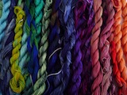

-   Added pthreads-based backend for cv::parallel_for\_. It means that all the parallel processing should be available out-of-the-box on any POSIX-compatible OS, including QNX and such. You are welcome to try it out.


-   OpenCV Manager on Android has been completely rewritten in Java and now supports both OpenCV 2.4 and 3.0. After a bit more testing we will put it to Google Play.
-   The other, a bit sad but inevitable news – we had to drop support for nativecamera on Android. It used some undocumented API and never worked stable.


-   Many excellent contributions in opencv_contrib/xfeatures2d:
    -   Christian Balint contributed long-awaited DAISY features
    -   He also contributed improved version of rotation-invariant BRISK descriptor by Gil Levi
    -   Gil Levi contributed very nice LATCH binary descriptor that outperforms all presently available in OpenCV binary descriptors (ORB, BRIEF, AKAZE etc.) and is comparable with heavier and slower SURF.


-   Over 80 pull requests have been merged in since 3.0 rc. Big thanks to all the people who submitted bug fixes, new functionality and other small and big improvements! This time special thanks goes to Philip (Dikay900) who did (and still does) excellent job on porting various bug fixes and other small improvements from 2.4 to master/3.0. Thank you, Philip!

### Contributors

#### opencv

    $ git shortlog —no-merges -ns 3.0.0-rc1..origin/master
    60  Vadim Pisarevsky
    31  laurentBerger
    17  Maksim Shabunin
    10  cbalint13
    7  Maxim Kostin
    6  Alexander Smorkalov
    6  Ilya Lavrenov
    6  StevenPuttemans
    6  Vladimir Dudnik
    5  Andrey Pavlenko
    5  GilLevi
    3  Dikay900
    3  Philipp Hasper
    3  Ruslan Baratov
    3  rajithr
    3  sgjava
    2  Andreas Stührk
    2  Christian Richardt
    2  Deanna Hood
    2  Joe Minichino
    2  Luis Díaz Más
    2  Mansour Moufid
    2  Marek Nogacki
    2  Martin Ueding
    2  Vladislav Vinogradov
    2  Zhigang Gong
    2  kalistratovag
    1  AfterEight
    1  Aleksandr Petrikov
    1  Alexander Nitsch
    1  Andrew Senin
    1  Ashod Nakashian
    1  Belev
    1  Boris Daskalov
    1  Camille
    1  Craig Reynolds
    1  David Hirvonen
    1  Ehren Metcalfe
    1  Evgeny Agafonchikov
    1  Jüri Aedla
    1  Leonid Beynenson
    1  Martijn Liem
    1  Marvin Smith
    1  Michaël Sdika
    1  Mike Maraya
    1  Milania1
    1  Niklas Frisk
    1  Owen Healy
    1  Patrik Huber
    1  Piotr Dobrowolski
    1  Roman Donchenko
    1  S. Garrido
    1  Samed Ozdemir
    1  Samuel Martin
    1  Samyak Datta
    1  Thomas Gabrowski
    1  Vicente Olivert Riera
    1  Vincent Rabaud
    1  Vladimir Kolesnikov
    1  aletheios
    1  berak
    1  jormansa
    1  lujia
    1  msandler
    1  yanlend
    1  zenev

#### opencv_contrib

    $ git shortlog —no-merges -ns 3.0.0-rc1..origin/master
    19  cbalint13
    11  GilLevi
    6  Alexandre Benoit
    4  Vadim Pisarevsky
    2  laurentBerger
    1  BISMOY MURASING
    1  berak
    1  root

version:3.0 rc
--------------

*April, 2015*

These are changes since 3.0 beta.


-   Improved compatibility with OpenCV 2.4:
    -   2.4.11 now includes “opencv2/core.hpp” and other such headers in addition to standard “opencv2/core/core.hpp”.
    -   smart pointers (Ptr&lt;&gt;) can now be created in both 2.4 and 3.0 style (new ClassName(params) vs makePtr(params))
    -   trained and stored stat models from opencv_ml 2.4 can now be loaded and used by opencv_ml 3.0 as-is.
    -   the 2.4=&gt;3.0 transition guide has been sketched: http://docs.opencv.org/master/db/dfa/tutorial_transition_guide.html


-   We did not put OpenCV 3 to Google Play yet, but we prepared installable OpenCV 3.0 Manager for Android, which can be installed and tried on your device. It can co-exist with OpenCV 2.4 Manager on the same device.


-   There are multiple improvements and bug-fixes for WinRT port (as well as Windows 8.x port) of OpenCV by Microsoft guys (big thanks to Max Kostin!)
    -   In particular, parallel_for is enabled on WinRT, so the code should run much faster on multi-core devices
    -   Also, the WMF video capturing backend has been greatly improved.


-   Standalone motion jpeg codec has been added to opencv_videoio. It does *not* need ffmpeg or any other 3rd-party lib. According to our measurements, it’s also much faster than ffmpeg, especially on ARM. For the decoder you should have JPEG support enabled (through built-in or external libjpeg). How to use it? To encode motion jpeg video, use .avi file extension and CV_FOURCC(‘M’, ‘J’, ‘P’, ‘G’). The decoder part has been verified on such streams (avi files with index, where each frame is encoded using baseline jpeg) and few random motion jpeg clips from net, but we have not tested it thoroughly.


-   Preliminary version of OpenCV HAL, low-level acceleration API beneath OpenCV, has been introduced. Currently it includes just a few math functions, but will grow soon. It also includes so-called “universal intrinsics”, inspired by NEON=&gt;SSE conversion header by Victoria Zhislina from Intel: https://software.intel.com/en-us/blogs/2012/12/12/from-arm-neon-to-intel-mmxsse-automatic-porting-solution-tips-and-tricks The idea is that one can use a single SIMD code branch that will compile to either SSE or NEON instructions depending on the target platform. For example,

    ```.cpp
    // a, b and c are floating-point arrays
    for( int i = 0; i < n; i+=4 )
        v_store(c + i, v_load(a+i) + v_load(b+i));
    ```

    will be expanded to either

    ```.cpp
    for( int i = 0; i < n; i+=4 )
        _mm_storeu_ps(c + i, mm_add_ps(_mm_loadups(a+i), mm_loadu_ps(b+i));
    ```

    or

    ```.cpp
    for( int i = 0; i < n; i+=4 )
        vst1q_f32(c + i, vaddq_f32(vld1q_f32(a+i), vld1qf32(b+i));
    ```

    Using such intrinsics one can write accelerated code, debug it on
    desktop and then run it without any changes on ARM and get reasonable performance.


-   Over 500 pull requests have been merged in since 3.0 beta. Big thanks to all the people who submitted bug fixes, new functionality and other small and big improvements! OpenCV becomes more and more a community-driven project and we are pleased to see that!

### Contributors

#### opencv

    $ git shortlog —no-merges -ns 3.0.0-beta..origin/master
    95  Vladislav Vinogradov
    88  Maksim Shabunin
    74  Ilya Lavrenov
    40  Erik Karlsson
    33  Olexa Bilaniuk
    28  Vadim Pisarevsky
    24  Dmitry-Me
    24  orestis
    18  StevenPuttemans
    17  Maxim Kostin
    15  Yan Wang
    14  Alexander Alekhin
    11  Roman Donchenko
    8  Ashod Nakashian
    7  Joe Howse
    7  Nisarg Thakkar
    6  Andrey Kamaev
    6  Dikay900
    5  Alexander Nitsch
    5  Evgeny Agafonchikov
    5  TobyWanKenobi
    5  theodore
    5  Сергей Нужный
    4  Andrew Senin
    4  Artur Wieczorek
    4  Hamid Bazargani
    4  Pavel Rojtberg
    4  berak
    3  Alexander Smorkalov
    3  Ben Hagen
    3  Deanna Hood
    3  Marvin Smith
    3  Nicu Știurcă
    3  Philipp Hasper
    3  Simon Heinen
    3  Takahiro Poly Horikawa
    3  Ying Xiong
    2  ASUS
    2  Ahmatnurov Dinar
    2  Alexander Duda
    2  Ana Huaman Quispe
    2  Eric Sommerlade
    2  Naer Chang
    2  Nils Plath
    2  Sync-my-L2P
    2  VBystricky
    2  guopei
    2  ippei ito
    2  kalistratovag
    2  karelknoest
    2  sanuj
    2  vbystricky
    1  Adam Borowski
    1  Adam Greig
    1  Alexander Bohn / FI$H2k
    1  Alexander Karsakov
    1  Andrey Pavlenko
    1  Ari Suwendi
    1  Basheer Subei
    1  Boaz Stolk
    1  Chris Mayo
    1  Chuanbo Weng
    1  Claudio Caraffi
    1  Daeyun Shin
    1  Daniel Angelov
    1  Daniel Sjölie
    1  Dmitriy Anisimov
    1  Florian Verdet
    1  Guo Yejun
    1  HelenWong
    1  Jay Bosamiya
    1  Jiri Drbalek
    1  Jonathan Viney
    1  Josep Bosch
    1  Julien Nabet
    1  Kai Wolf
    1  Kevin Squire
    1  LorenaGdL
    1  Max Kostin
    1  Michae Gharbi
    1  Mike Izbicki
    1  Nicolas Riebesel
    1  Owen Healy
    1  Pat O’Keefe
    1  Pavel Vlasov
    1  Prof. Dr. Rudolf Haussmann
    1  Quentin Minster
    1  RafaRuiz
    1  Rok Mandeljc
    1  S. Garrido
    1  Samyak Datta
    1  Sancho McCann
    1  Scott Graybill
    1  Shiquan Wang
    1  Tim D. Smith
    1  Timur Sattarov
    1  Tzafrir
    1  UQ Times
    1  Yang Fan
    1  burun
    1  eltermann
    1  exeltior
    1  fhsm
    1  greensea
    1  hahne
    1  mariadeanton
    1  potpath
    1  sergei
    1  soyer
    1  tcavallari
    1  tt
    1  ttagu99
    1  vincentweb

#### opencv_contrib

    $ git shortlog —no-merges -ns 3.0.0-beta..origin/master
    13  Maksim Shabunin
    5  cbalint13
    3  Auron-X
    3  Dikay900
    3  Str3iber
    2  Dmitriy Anisimov
    2  Jay Bosamiya
    2  Rok Mandeljc
    2  Vadim Pisarevsky
    2  berak
    1  Alfonso Sanchez-Beato
    1  Antonella Cascitelli
    1  Beat Küng
    1  Dinar Ahmatnurov
    1  Nisarg Thakkar
    1  Sh0
    1  Shuda Li
    1  StevenPuttemans
    1  Vladimir
    1  Yan Wang
    1  jiaolong_cvc228
    1  pmkalshetti
    1  yifita

version:3.0 beta
----------------

*November, 2014*

These are changes since 3.0 alpha.


-   Performance of OpenCL-accelerated code on Intel Iris Graphics and Intel Iris Pro Graphics has been improved by 10%-230%. That includes faster Canny edge detector, Laplacian, StereoBM, BruteForceMatcher, BackgroundSubtractorMOG2, StitchingWarpers etc. New OpenCL kernels were implemented for several functions: HoughLines, HoughLinesP, cvtColor (selected modes), Gemm, DFT. Thanks Alexander Alekhin, Alexander Karsakov, Elena Gvozdeva, Vladimir Bystritsky, Sergey Sivolgin and other guys who did that!


-   About 40 commonly used image processing functions have been optimized using vector NEON instructions, so OpenCV 3.0 beta should run noticeably faster on modern ARM chips. Big thanks to Ilya Lavrenov for the amazing job!


-   Java bindings have been substantially improved. We now have bindings for the updated features2d, background subtractor classes, a part of opencv_contrib etc. Thanks to Maksim Shabunin for the improvements!


-   On x86 and x64 platforms OpenCV binaries include and use a subset of Intel® Integrated Performance Primitives (Intel® [IPP](opencv3#ipp)) by default. OpenCV 3.0 beta includes a subset of **Intel® IPP 8.2.1** with additional optimization for AVX2.


-   Over 200 pull requests have been merged in since 3.0 alpha. Big thanks to all the people who submitted bug fixes, new functionality and other small and big improvements! OpenCV becomes more and more a community-driven project and we are pleased to see that!

### Contributors

#### opencv

    $ git shortlog —no-merges -ns 3.0.0-alpha..origin/master
    129  edgarriba
    71  Ilya Lavrenov
    45  Alexander Karsakov
    41  Adrien BAK
    39  Rahul Kavi
    37  Vadim Pisarevsky
    27  Maksim Shabunin
    20  Ernest Galbrun
    15  Dmitriy Anisimov
    14  Artur Wieczorek
    13  Alexander Mordvintsev
    12  Alexander Alekhin
    9  vbystricky
    9  Alexander Smorkalov
    9  Rok Mandeljc
    8  Elena Gvozdeva
    8  Marc Rollins
    7  Philipp Hasper
    5  berak
    5  ElenaGvozdeva
    4  PhilLab
    3  Juan Carlos Niebles
    3  Alexander Duda
    3  Alexander Shishkov
    3  xantares
    3  jaco
    3  Brian Park
    3  Chuanbo Weng
    3  Igor Kuzmin
    3  Michele Adduci
    2  Andrey Pavlenko
    2  Bence Magyar
    2  Miroslav Benes
    2  Shubhra Pandit
    2  StevenPuttemans
    2  abidrahmank
    2  f-morozov
    2  micha137
    1  Jose-Luis Blanco-Claraco
    1  Pat O’Keefe
    1  Pavel Vlasov
    1  John Kua
    1  Huu Nguyen
    1  Pierrick Koch
    1  Poly Takahiro Horikawa
    1  GregoryMorse
    1  Felix Endres
    1  Benoit Seguin
    1  jeremy
    1  Tomasz Posłuszny
    1  U-KruchininD-ПК\KruchininD
    1  VBystricky
    1  Dmitry Gribanov
    1  Yan Wang
    1  Yusuke Suzuki
    1  Anatoly Baksheev
    1  bartaandras
    1  Daniel Stonier
    1  dkanafeev
    1  Boaz Stolk
    1  eltermann
    1  Ling Wang@z77x
    1  Manfred Georg
    1  Leszek Swirski
    1  Matthew Conway
    1  Maximilien Cuony
    1  Ariel Elkin

#### opencv_contrib

    $ git shortlog —no-merges -ns e2fde8..origin/master
    69  biagio montesano
    55  Vlad Shakhuro
    46  Alex Leontiev
    36  Bellaktris
    28  Vadim Pisarevsky
    24  lluis
    19  dmitriy.anisimov
    18  vludv
    11  Dmitriy Anisimov
    10  Bence Magyar
    10  Daniel Angelov
    10  Alexander Shishkov
    9  ahb
    6  tpietruszka
    5  Maksim Shabunin
    5  Beat Küng
    4  manuele
    4  StevenPuttemans
    4  Alexander Mordvintsev
    4  vbystricky
    3  Philipp Hasper
    3  berak
    3  Sancho McCann
    2  Alexander Alekhin
    2  Ilya Lavrenov
    2  Alexandre Benoit
    1  tolgabirdal
    1  Shuda Li
    1  Rok Mandeljc
    1  VBystricky
    1  Poly Takahiro Horikawa
    1  Michele Adduci
    1  Ernest Galbrun

version:3.0 alpha
-----------------

*August, 2014*

This is brief version of the change log. There is also a separate page with detailed review of [OpenCV_3.0](opencv3)


-   OpenCV 3.0 brings more GPU accelerated functions and makes it in much more convenient form than OpenCV 2.4.
    -   The new technology is nick-named “Transparent API” and, in brief, is extension of classical OpenCV functions, such as cv::resize(), to use OpenCL underneath. See more details about it here: [T-API](opencv3#tapi).
    -   Along with OpenCL code refactoring and Transparent API implementation OpenCL kernels were optimized for mainstream platforms, most notably for modern Intel chips (including Iris and Iris Pro) and AMD chips (such as Kaveri). More detailed results are to be provided later.


-   On x86 and x64 platforms OpenCV binaries include and use a subset of Intel® Integrated Performance Primitives (Intel® [IPP](opencv3#ipp)) by default. Intel Corporation granted OpenCV Foundation and all our users the right to use those functions free of charge for both non-commercial and commercial use.


-   We now have a separate repository for community-contributed code http://github.com/opencv/opencv_contrib. It will help us to combine well-known maturity and stability of classical OpenCV functionality together with innovative algorithms and opens new opportunities for community to share computer vision code. For all the contributed code we provide the same QA infrastructure as for the main OpenCV repository. How to use it?
-   Grab a copy of contribution repository http://github.com/opencv/opencv_contrib along with a copy of OpenCV 3.0 alpha or a fresh master snapshot.
-   Pass `OPENCV_EXTRA_MODULES_PATH=<path_to_contrib_directory>/modules` to CMake.
-   Documentation for the contributed modules is integrated into OpenCV doc tree: http://docs.opencv.org/master


-   We completely revised our QA infrastructure (big thanks to Alexander Alekhin), which now covers not only the main repository, but also the contrib repository as well: http://pullrequest.opencv.org.

 

-   OpenCV 3.0 and its contribution repository feature a lot of new functionality created by our GSoC students during the past 2 years, namely:
    -   Text detection and recognition by Lluis Gomez and Stefano Fabri
    -   HDR by Fedor Morozov
    -   KAZE/A-KAZE by Eugene Khvedchenya, the algorithm author Pablo Alcantarilla and some improvements by F. Morozov.
    -   Smart segmentation and edge-aware filters by Vitaly Lyudvichenko, Yuri Gitman, Alexander Shishkov and Alexander Mordvintsev
    -   Car detection using Waldboost, ACF by Vlad Shakhuro and Nikita Manovich
    -   TLD tracker and several common-use optimization algorithms by Alex Leontiev
    -   Matlab bindings by Hilton Bristow, with support from Mathworks.
    -   Greatly extended Python bindings, including Python 3 support, and several OpenCV+Python tutorials by Alexander Mordvintsev, Abid Rahman and others.
    -   3D Visualization using VTK by Ozan Tonkal and Anatoly Baksheev.
    -   RGBD module by Vincent Rabaud
    -   Line Segment Detector by Daniel Angelov
    -   Many useful Computational Photography algorithms by Siddharth Kherada
    -   Shape descriptors, matching and morphing shapes (shape module) by Juan Manuel Perez Rua and Ilya Lysenkov
    -   Long-term tracking + saliency-based improvements (tracking module) by Antonella Cascitelli and Francesco Puja
    -   Another good pose estimation algorithm and the tutorial on pose estimation by Edgar Riba and Alexander Shishkov
    -   Line descriptors and matchers by Biagio Montesano and Manuele Tamburrano


-   There are many other contributions, besides GSoC programs. Here is incomplete list (PLEASE, mail to admin at opencv.org if your name is missing here):
    -   Myriads of improvements in various parts of the library by Steven Puttemans; thank you a lot, Steven!
    -   Several NEON optimizations by Adrian Stratulat, Cody Rigney, Alexander Petrikov, Yury Gorbachev and others.
    -   Fast foreach loop over cv::Mat by Kazuki Matsuda
    -   Image alignment (ECC algorithm) by Georgios Evangelidis
    -   GDAL image support by Marvin Smith
    -   RGBD module by Vincent Rabaud
    -   Fisheye camera model by Ilya Krylov
    -   OSX framework build script by Eugene Khvedchenya
    -   multiple FLANN improvements by Pierre-Emmanuel Viel
    -   Improved WinRT support by Gregory Morse
    -   Latent SVM Cascade by Evgeniy Kozhinov and NNSU team (awaiting integration)
    -   Logistic regression by Rahul Kavi
    -   Five-point pose estimation algorithm by Bo Li

Also, big thanks to all the Itseez guys who reviewed patches, watched bug reports and helped OpenCV in many other ways:
Alexander Shishkov (who also maintains opencv.org site), Andrey Pavlenko, Alexander Alekhin, Alexander Smorkalov, Roman Donchenko, Kirill Kornyakov, Andrey Kamaev, Sergey Sivolgin, Vladimir Bystritsky, Sergey Nosov, Nikita Manovich, Evgeniy Talanin, Elena Gvozdeva, Alexander Karsakov, Konstantin Matskevich, Ilya Lavrenov, Anna Kogan, Ivan Korolev, Dinar Ahmatnurov, Andrey Senin, Vlad Vinogradov, Alexey Spizhevoy, Anatoly Baksheev, Marina Kolpakova, Daniil Osokin, Leonid Beynenson, Dmitry Retinsky, Maria Dimashova, Ilya Lysenkov, Andrey Morozov, Victor Eruhimov, Alexander Bovyrin, Sergey Molinov, Gary Bradski, Vincent Rabaud, Harris Gasparakis, Stefano Fabri and many others.


-   Although OpenCV 3 can be viewed as refined OpenCV 2 and is similar to the latter, this new version is not completely backward-compatible with OpenCV 2. Here are some major changes:
    -   Some functionality has been moved to opencv_contrib repository or just disappeared. After revision, we may put a part of disappeared functionality back to opencv (or opencv_contrib).
    -   Note that among the moved functionality is Face Recognition (now a separate module opencv_contrib/face); SIFT, SURF, FREAK, Star feature detectors and descriptors (now a part of opencv_contrib/xfeatures2d); text detector (now a part of module opencv_contrib/text); matlab bindings (opencv_contrib/matlab); motion templates & simple flow (opencv_contrib/optflow).
    -   In OpenCV 3 we write

        ```.cpp
        #include “opencv2/core.hpp”
        ```

        instead of

        ```.cpp
        #include “opencv2/core/core.hpp”
        ```

        The old method should also work.
    -   ML module has been completely revised (and at the moment the functionality is not 100% match for OpenCV 2.4.x), you will need to update your code.
    -   Similarly to ML, many high-level algorithms have been refactored to follow “open interface-hidden implementation” concept and this refactoring work will continue after alpha.
    -   To lower the footprint, highgui module has been split into 3 parts: imgcodecs, videoio and highgui itself (thanks to Vladimir). You may need to update your code.
    -   After massive functionality migration to opencv_contrib and other major changes some Python bindings may be missing. We will fix it by OpenCV 3.0 beta.

version:2.4.9
-------------

*April, 2014*


-   Several improvements in OpenCL optimizations (`ocl::sum`, `ocl::countNonZero`, `ocl::minMax`, bitwise operationss, Haar face detector, etc)


-   Multiple fixes in Naitve Camera (NativeCameraView, cv::VideoCapture);
-   Improved CUDA support for all CUDA-enabled SoCs.

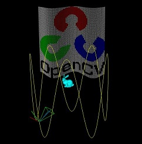

-   **New** VTK-based 3D visualization module `viz` stabilized and back-ported to 2.4 branch. The module provides a very convenient way to display and position clouds, meshes, cameras and trajectories, and simple widgets (cube, line, circle, etc.). Full demo video can be found at [Itseez Youtube channel](http://www.youtube.com/watch?v=75Ytgy3QT9s)

-   Numerous bugfixes in code and docs from community


-   **156** pull requests have been merged since version\#20


-   **55** reported bugs have been closed since version\#20

### Contributors

    $ git checkout 2.4.9
    $ git shortlog --no-merges -n  -s 2.4 --not 2.4.8
    36  Alexander Smorkalov
    35  Ilya Lavrenov
    33  Vladislav Vinogradov
    23  Anatoly Baksheev
    16  Andrey Pavlenko
    9  Maks Naumov
    8  Roman Donchenko
    6  Pierre-Emmanuel Viel
    6  yash
    5  Daniil Osokin
    4  Alexander Karsakov
    4  Alexander Shishkov
    4  Matti Picus
    4  Nghia Ho
    4  Stuart Cunningham
    4  Vadim Pisarevsky
    3  Alexander Alekhin
    3  Kang Liu
    3  Seunghoon Park
    3  Vincent Rabaud
    2  Firat Kalaycilar
    2  Martin Jul
    2  RJ2
    2  berak
    1  Alessandro Trebbi
    1  Cody Rigney
    1  ComFreek
    1  Dave Hughes
    1  David Rolland
    1  Drew Jetter
    1  Evgeniy
    1  Ian Taylor
    1  JinoBetti
    1  Kazuki Matsuda
    1  Kirill Kornyakov
    1  Konstantin Matskevich
    1  Linquize
    1  Marijan Vukcevich
    1  Martin Chodakowski
    1  Robbert Klarenbeek
    1  Vladimir Kolesnikov
    1  Zhigang Gong
    1  ahb
    1  kuroda sho
    1  kurodash

version:2.4.8
-------------

*December, 2013*


-   User provided OpenCL context can be used by OpenCV (
    [ocl::initializeContext](http://docs.opencv.org/2.4/modules/ocl/doc/structures_and_utility_functions.html#ocl-initializecontext) )
-   A separate OpenCL command queue is created for every CPU thread (allows concurrent kernels execution)
-   Some new OpenCL optimizations and bug-fixes


-   NVidia CUDA support on CUDA capable SoCs;
-   Android 4.4 support, including native camera;
-   Java wrappers for GPU-detection functions
    from core module were added;
-   New sample with CUDA on Android was added;
-   OpenCV Manager and apps hanging were fixed on Samsung devices with
    Android 4.3 (\#3368, \#3372, \#3403, \#3414, \#3436)


-   Static linkage support for native C++ libraries;


-   **139** pull requests have been merged since version:2.4.7!


-   **32** reported bugs have been closed since version:2.4.7

### Contributors

    $ git checkout 2.4.8
    $ git shortlog --no-merges -n  -s 2.4 --not 2.4.7
    42  Alexander Smorkalov
    35  Ilya Lavrenov
    15  Roman Donchenko
    15  Vladislav Vinogradov
    14  Alexander Alekhin
    11  krodyush
    10  Andrey Pavlenko
    9  Vladimir Bystricky
    8  StevenPuttemans
    7  Baichuan Su
    7  Konstantin Matskevich
    7  perping
    6  Adrien BAK
    6  Mimmmo Cosenza
    6  Vincent Rabaud
    4  Peter Andreas Entschev
    4  Philippe FOUBERT
    3  Anatoly Baksheev
    3  berak
    2  Alexander Karsakov
    2  Bo Hu
    2  GregoryMorse
    2  Piotr Miecielica
    2  moodoki
    1  Alex Willisson
    1  Alexander Shishkov
    1  Alfonso (the fonz) de la Osa
    1  Andrey Kamaev
    1  Eric Sommerlade
    1  Josep Bosch
    1  Kiran Pradeep
    1  Matthias Bady
    1  Peng Xiao
    1  Pierre-Emmanuel Viel
    1  Séverin Lemaignan
    1  Zhigang Gong
    1  dpen2000
    1  huangs
    1  tim36272

version:2.4.7
-------------

*November, 2013*


-   Now ‘ocl’ module can be built without installing OpenCL SDK (Khronos headers in OpenCV tree);
-   Dynamic dependency on OpenCL runtime (allows run-time branching
    between OCL and non-OCL implementation);
-   Changing default OpenCL device via `OPENCV_OPENCL_DEVICE`
    environment variable (without app re-build);
-   Refactoring/extending/bug-fixing of existing OpenCL optimizations,
    updated documentation;
-   New OpenCL optimizations of SVM, MOG/MOG2, KalmanFilter and more;


-   New optimization for histograms, TV-L1 optical flow and resize;
-   Updated multi gpu sample for stereo matching;
-   Fixed BGR&lt;→YUV color conversion and bitwize operations;
-   Fixed several build issues;


-   Android NDK-r9 (x86, x86_64) support;
-   Android 4.3 support: hardware detector (Bugs \#3124, \#3265, \#3270)
    and native camera (Bug \#3185);
-   MediaRecorder hint enabled for all Android devices with API level 14 and above;
-   Fixed JavaCameraView slowdown (Bugs \#3033, \#3238);


-   Fixed MS Certification test issues for all algorithmical modules and
    highgui, except OpenEXR and Media Foundation code for camera;
-   Implemented XAML-based sample for video
    processing using OpenCV;
-   Fixed issue in Media Foundation back-end for VideoCapture (\#3189);


-   **382** pull requests have been merged since version:2.4.6!


-   **54** reported bugs have been fixed since version:2.4.6 ([issue tracker query](http://code.opencv.org/projects/opencv/issues?query_id=52))

### Contributors

    $ git checkout 2.4.7
    $ git shortlog --no-merges -n  -s 2.4 --not 2.4.6
    111  Ilya Lavrenov
    83  Alexander Alekhin
    79  Roman Donchenko
    41  Alexander Smorkalov
    36  peng xiao
    34  Jin Ma
    32  Vladislav Vinogradov
    27  StevenPuttemans
    19  yao
    17  Andrey Pavlenko
    13  kdrobnyh
    12  ilya-lavrenov
    9  Alexander Shishkov
    8  Vadim Pisarevsky
    7  Greg Hale
    7  Jan Starzynski
    6  Bahram Dahi
    5  Dmitry Retinskiy
    5  Nghia Ho
    5  konstantin
    5  perping
    3  Alexander Mordvintsev
    3  Frederic Devernay
    3  Kirill Kornyakov
    3  Peng Xiao
    3  Sebastian KrA¤mer
    3  WonderRico
    3  kamjagin
    2  Alexander Pacha
    2  Daniil Osokin
    2  Gabe Schwartz
    2  Hanusz Leszek
    2  Nikita Manovich
    2  Philippe FOUBERT
    2  Zac Stewart
    1  Alexander Karsakov
    1  Andrew Senin
    1  Baris Evrim Demiroz
    1  Csaba Kertesz
    1  George Andrew Brindeiro
    1  Han Qiang
    1  Harris Gasparakis
    1  Heinz Hofbauer
    1  Kevin
    1  MarkBelmont
    1  Michael Hanselmann
    1  Miroslav Kobetski
    1  Samuel Wejeus
    1  Sebastian Kramer
    1  abidrahmank
    1  kocheganovvm
    1  pengxiao

version:2.4.6
-------------

*July, 2013*


-   Windows RT: added video file i/o and sample application using
    camera, enabled parallelization with TBB
    or MS Concurrency


-   CUDA 5.5: added support for desktop and
    ARM


-   added Qt 5 support


-   Binary compatiblility with both OpenCL 1.1/1.2 platforms. Now the
    binaries compiled with any of AMD/Intel/Nvidia’s SDK
    can run on all other platforms.
-   New functions ported, CLAHE,
    GoodFeaturesToTrack, TVL1 optical flow and more.
-   Performance optimizations, HOG and more.
-   More kernel binary cache options though
    setBinaryDiskCache interface.
-   OpenCL binaries are now included into the superpack for Windows (for
    VS2010 and VS2012 only)


-   switched all the remaining parallel loops from TBB-only `tbb::parallel_for()` to universal
    `cv::parallel_for_()` with many possible backends (MS Concurrency,
    Apple’s GDC, OpenMP, Intel TBB etc.)


-   `iOS` build scripts (together with `Android` ones) moved to
    `opencv/platforms` directory
-   fixed bug with incorrect saved video from camera through
    CvVideoCamera
-   added `rotateVideo` flag to the `CvVideoCamera` class to
    control camera preview rotation on device rotation
-   added functions to convert between `UIImage` and `cv::Mat` (just
    include `opencv2/highgui/ios.h`)


-   [numerous bug-fixes](http://code.opencv.org/projects/opencv/issues?query_id=52)
    across all the library


-   see also [Android_Release_Notes](Android_Release_Notes)

### Contributors

    ~/Work/OpenCV/opencv> git checkout 2.4.6
    ~/Work/OpenCV/opencv> git shortlog --no-merges -n -s 2.4 --not 2.4.5
    55  Peng Xiao
    50  yao
    41  Roman Donchenko
    40  Alexander Smorkalov
    21  Vladislav Vinogradov
    10  Kirill Kornyakov
    9  Andrey Pavlenko
    8  Alexander Shishkov
    8  Andrey Kamaev
    5  alex77git
    5  Dominik Rose
    4  Ivan Korolev
    3  Sergei Nosov
    3  abidrahmank
    3  poiuytrez
    2  Leszek Swirski
    1  Bo Li
    1  Jan Machacek
    1  ShengyinWu
    1  Siva Prasad Varma
    1  Gurpinder Singh Sandhu
    1  Andrew Senin
    1  Peter Minin
    1  caorong
    1  dave
    1  ograycode
    1  Dustin Spicuzza
    1  Luis Díaz Más
    1  Egbert van der Wal

version:2.4.5
-------------

*April, 2013*


-   Experimental WinRT support (build for [WindowsRT](WindowsRT) guide)

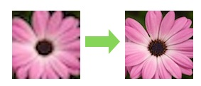

-   the new video super-resolution module has been added that implements
    the following papers:

    - S. Farsiu, D. Robinson, M. Elad, P. Milanfar. Fast and robust Super-Resolution. Proc 2003 IEEE Int Conf on Image Process, pp. 291–294, 2003.
    - D. Mitzel, T. Pock, T. Schoenemann, D. Cremers. Video super resolution using duality based TV-L1 optical flow. DAGM, 2009.

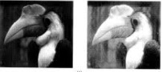

-   CLAHE (adaptive histogram equalization)
    algorithm has been implemented, both CPU
    and GPU-accelerated versions (in imgproc
    and gpu modules, respectively)


-   there are further improvements and extensions in ocl module:\
    - 2 stereo correspondence algorithms: stereobm (block matching) and
    stereobp (belief propagation) have been added\
    - many bugs fixed, including some crashes on Intel HD4000


-   The tutorial on displaying `cv::Mat` inside Visual Studio 2012
    debugger has been contributed by Wolf Kienzle from
    Microsoft Research. See
    http://opencv.org/image-debugger-plug-in-for-visual-studio.html


-   78 pull requests have been merged. Big thanks to everybody who
    contributed!


-   At least 25 bugs have been fixed since 2.4.4 (see
    http://code.opencv.org/projects/opencv/issues select closed issues
    with target version set to “2.4.5”).

version:2.4.4
-------------

*March, 2013*


-   This is the biggest news in 2.4.4 – we’ve got full-featured OpenCV
    Java bindings on a desktop, not only Android! In fact you can use
    any JVM language, including functional
    Java or handy Groovy. Big thanks to [Eric Christiansen](https://plus.google.com/u/0/114834902961564956461) for
    the contribution! Check the
    [tutorial](http://docs.opencv.org/doc/tutorials/introduction/desktop_java/java_dev_intro.html)
    for details and code samples.


-   Android application framework, samples, tutorials, OpenCV Manager
    are updated, see [Android_Release_Notes](Android_Release_Notes) for details.


-   Numerous improvements in `gpu` module and the following new
    functionality & optimizations:
    -   Optimizations for the NVIDIA Kepler
        architecture
    -   NVIDIA CARMA
        platform support
    -   HoughLinesP for line segments detection
    -   Lab/Luv &lt;→ RGB conversions


-   Let us be more verbose here. The openCL-based hardware
    acceleration (ocl) module is now mature, and, with numerous bug
    fixes, it is largely bug-free. Correct operation has been verified
    on all tested platforms, including discrete GPUs (tested on NVIDIA and AMD
    boards), as well as integrated GPUs (AMD
    APUs as well as Intel Ivy Bridge iGPUs). On the host side, there has
    been exhaustive testing on 32/64 bit, Windows/Linux systems, making
    the ocl module a very serious and robust cross-platform GPU hardware acceleration solution. While we
    currently do not test on other devices that implement OpenCL (e.g.
    FPGA, ARM or
    other processors), it is expected that the ocl module will work well
    on such devices as well (provided the minimum requirements explained
    in the user guide are met).\
    Here are specific highlights of the 2.4.4 release:
    -   The `ocl::Mat` can now use “special” memory (e.g. pinned memory,
        host-local or device-local).
    -   The ocl module can detect if the underlying hardware supports
        “integrated memory,” and if so use “device-local” memory by
        default for all operations.
    -   New arithmetic operations for `ocl::Mat`, providing significant
        ease of use for simple numerical manipulations.
    -   Interop with OpenCL enables very easy integration of OpenCV in
        existing OpenCL applications, and vice versa.
    -   New algorithms include Hough circles, more color conversions
        (including YUV, YCrCb), and
        Hu Moments.
    -   Numerous bug fixes, and optimizations, including in:
        blendLinear, square samples, erode/dilate, Canny, convolution
        fixes with AMD FFT library, mean shift filtering,
        Stereo BM.
    -   Platform specific bug fixes: PyrLK, bruteForceMatcher,
        faceDetect now works also on Intel Ivy Bridge chips (as well as
        on AMD APUs/GPUs and NVIDIA GPUs); erode/dilate also works on
        NVIDIA GPUs (as well as AMD APUs/GPUs and Intel iGPUs).


-   Many people contributed their code in the form of [pull
    requests](https://github.com/opencv/opencv/pulls?direction=desc&page=1&sort=created&state=closed).
    Here are some of the most interesting contributions, that were
    included into 2.4 branch:
    -   “&gt;100”:http://code.opencv.org/projects/opencv/versions/11
        reported problems have been resolved since 2.4.3
    -   Oscar Deniz
        [submitted](https://github.com/opencv/opencv/pulls?direction=desc&page=1&sort=created&state=closed)
        smile detector and sample.
    -   Alexander Smorkalov created a
        [tutorial](http://docs.opencv.org/doc/tutorials/introduction/crosscompilation/arm_crosscompile_with_cmake.html#arm-linux-cross-compile)
        on cross-compilation of OpenCV for Linux on ARM platforms.

version:2.4.3
-------------

*November, 2012*


-   Added universal `parallel_for` implementation using various
    backends: TBB (cross-platform:
    http://threadingbuildingblocks.org), OpenMP (cross-platform:
    http://en.wikipedia.org/wiki/OpenMP), Grand Central Dispatch
    (iOS/MacOSX: http://en.wikipedia.org/wiki/Grand_Central_Dispatch),
    Concurrency (Visual Studio 2010 or later:
    http://msdn.microsoft.com/en-us/library/dd492418.aspx),
    C= (http://www.hoopoesnest.com/cstripes/cstripes-details.htm). Many
    exiting parallel OpenCV algorithms have been converted to the
    new primitive. Therefore, you can enjoy performance improvements
    even without having to install TBB and
    ship it with OpenCV-based applications.


-   Improved OpenCV Manager, new Java samples framework, better camera
    support on Android, see \[\[Android_Release_Notes\]\] for details.


-   **opencv2.framework** is now iOS6- and iPhone5- (armv7s) compatible.
    Thanks to the new threading mechanism several important OpenCV
    algorithms (e.g. face detection, bilateral filter, etc.) now run
    faster on A5 or newer dual-core chips. We also fixed bug in the
    framework build script and now the framework is built with “-O3”
    optimization instead of “-O0” in OpenCV 2.4.2. Finally, our GSoC
    students, Eduard Feicho and Charu Hans, have written detailed
    tutorials on how to add OpenCV to your iOS app, please,
    check http://docs.opencv.org/doc/tutorials/ios/table_of_content_ios/table_of_content_ios.html.


-   Another our GSoC student, Alexander Mordvintsev, added several new
    exciting Python samples, including ASIFT,
    hand-written digit recognition, motion debluring and even the use of
    Amazon PiCloud. Check
    https://github.com/opencv/opencv/tree/master/samples/python2

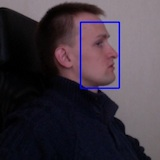

-   Yet another GSoC student Attila Novak has trained 2 new cascades,
    for silverware and profile faces. Check
    https://github.com/opencv/opencv/tree/master/data/lbpcascades

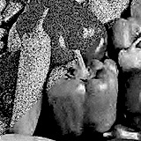

-   Another result from GSoC (that was a good year!): Victor Passichenko
    implemented non-local means denoising algorithm. It’s not realtime,
    but quite decent. Please, check
    http://docs.opencv.org/trunk/modules/photo/doc/denoising.html

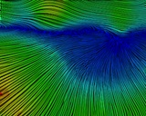

-   Yet another result from GSoC (that was a good year indeed!): Yuri
    Zemlyansky implemented “simple flow” optical flow algorithm;
    check https://github.com/opencv/opencv/tree/master/samples/cpp/simpleflow_demo.cpp.


-   Numerous improvements and new functionality in GPU module:\
    - device layer opened for users; now users write CUDA device code using OpenCV.\
    - LBP cascade support in cascade
    classifier\
    - fast non local means image denoising\
    - faster integral image calculation on Kepler\
    - Hough circles, Hough lines and generalized Hough transform
    implementation\
    - bilateral filter\
    - generalized Flood Fill connected component labeling\
    - background/foreground segmentation algorithms: Mixture of
    Gaussian, ViBe, GMG (A. Godbehere, A.
    Matsukawa, K. Goldberg) .\
    - added confidence calculation into HOG


-   Technology-preview version of ocl – OpenCL-accelerated computer
    vision algorithms, contributed by the Chinese Academy of Science. It
    includes:\
    - arithmetical operations\
    - filtering\
    - geometrical image transformations (resize, remap etc.)\
    - cascade classifier (i.e. face detector)\
    - optical flow\
    currently, it only runs on GPUs.

http://code.opencv.org/attachments/download/1147


-   ~130 reported problems have been resolved since 2.4.2


-   OpenCV has never been that social. We are at github
    now: http://github.com/opencv/opencv. Grab the latest versions from
    there, submit pull requests.


-   Since 2.4.3rc we fixed several build problems (OpenCV-based
    applications on Xcode 4.5 & iOS6, OpenCV+TBB on Windows etc.) and
    closed a few issues, reported at code.opencv.org.

version:2.4.2
-------------

*July, 2012*


-   Android package introduces a new service-based distribution model
    (see \[\[Android_Release_Notes\]\] for details).

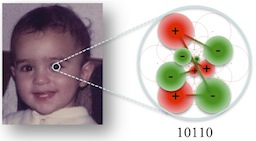

-   New keypoint descriptor FREAK has been
    contributed by EPFL group: Kirell Benzi,
    Raphael Ortiz, Alexandre Alahi and Pierre Vandergheynst. It’s
    claimed to be superior to ORB and SURF descriptors, yet it’s very fast (comparable
    to ORB). Please,
    see source://trunk/opencv/samples/cpp/freak_demo.cpp.


-   Improved face recognizer and excellent tutorial on using it has been
    added by Philipp Wagner. Check the [face recognition
    tutorial](http://docs.opencv.org/modules/contrib/doc/facerec/facerec_tutorial.html).


-   **opencv2.framework** for iOS has been created. You can either
    download the binary from SourceForge or build it yourself using the
    simple
    guide: http://docs.opencv.org/doc/tutorials/introduction/ios_install/ios_install.html\#ios-installation.
    Also, you may be interested to look at some OpenCV on iOS samples,
    created by our GSoC 2012 students Eduard and Charu:
    gsoc2012:source:/ios/trunk and read the slides of the tutorial:
    gsoc2012:source:/ios/trunk/doc/CVPR2012_OpenCV4IOS_Tutorial.pdf


-   [Another 50
    bugs](http://code.opencv.org/projects/opencv/issues?fixed_version_id=6&set_filter=1&status_id=5)
    have been fixed since 2.4.1 release.


-   It’s not about the code, but now we have the brand-new user site,
    http://opencv.org and the new stack overflow-like site with answers
    to the most popular questions http://answers.opencv.org


-   GPU module:\
    - reimplemented CUDA accelerated
    gpu::PyrLKOpticalFlow for dense and sparse cases. New implementation
    up 1.5 – 2 times faster then previous GPU optimized. Updated optical flow samples\
    - implemented resize with area interpolation. CUDA optimized version for integer matrix types
    up 30 – 35 faster then not optimized OpenCV implementation and up 7
    in worst case of 3 channel floating point matrix.

2.4.1
-----

*June, 2012*

-   The GPU module now supports CUDA 4.1 and CUDA 4.2
    and can be compiled with CUDA 5.0 preview.

Added API for storing OpenCV data structures
in text string and reading them back:\

    //==== storing data ====
    FileStorage fs(".xml", FileStorage::WRITE + FileStorage::MEMORY);
    fs << "date" << date_string << "mymatrix" << mymatrix;
    string buf = fs.releaseAndGetString();

    //== reading it back ==

    FileStorage fs(buf, FileStorage::READ + FileStorage::MEMORY);

    fs[“date”] >> date_string;

    fs[“mymatrix”] >> mymatrix;

-   [`cv::calcOpticalFlowPyrLK`](http://docs.opencv.org/modules/video/doc/motion_analysis_and_object_tracking.html#calcopticalflowpyrlk)
    now supports precomputed pyramids as input.

<!-- -->

-   Function signatures in documentation are made consistent with
    source code.

<!-- -->

-   Restored python wrappers for SURF and
    MSER.

<!-- -->

-   [45 more
    bugs](http://code.opencv.org/projects/opencv/issues?fixed_version_id=5&set_filter=1&status_id=5)
    in our bug tracker have been fixed

version:2.4.0
-------------

*May, 2012*

The major changes since 2.4 beta

-   OpenCV now provides pretty complete build information
    via cv::getBuildInformation().

<!-- -->

-   reading/writing video via ffmpeg finally works and is now available
    on MacOS X too.\
    note 1: we now demand reasonably fresh versions of ffmpeg/libav with
    libswscale included.\
    note 2: if possible, try to avoid reading or writing more than one
    video simultaneously (even within a single thread) with ffmpeg 0.7.x
    or earlier, since they seem to use some global structures that are
    destroyed by the codecs executed synchronously. Either build and
    install a newer ffmpeg (0.10.x is recommended), or serialize your
    video i/o, or use parallel processes instead of threads.

<!-- -->

-   MOG2 background subtraction by Zoran Zivkovic was optimized using
    TBB.

<!-- -->

-   The reference manual has been updated to match OpenCV 2.4.0.

<!-- -->

-   More than 20 bugs have been closed in our bug tracker.
    (http://code.opencv.org/projects/opencv/roadmap).

<!-- -->

-   Asus Xtion is now properly supported for HighGUI. For now, you have
    to manually specify this device by
    using VideoCapture(CV_CAP_OPENNI_ASUS) instead
    of VideoCapture(CV_CAP_OPENNI).

2.4 beta
--------

*April, 2012*

As usual, we created 2.4 branch in our repository
(http://code.opencv.org/svn/opencv/branches/2.4), where we will further
stabilize the code. You can check this branch for changes periodically,
before as well as after 2.4 release.

### Common changes

-   At the age of 12, OpenCV got its own home! http://code.opencv.org is
    now the primary site for OpenCV development and http://opencv.org
    will be the official OpenCV user site.

-   Some of the old functionality from the modules `imgproc`, `video`,
    `calib3d`, `features2d`, `objdetect` has been moved to legacy.

-   CMake scripts have been substantially modified. Now it’s very easy
    to add new modules – just put the directory with include, src, doc
    and test sub-directories to the modules directory, create a very
    simple `CMakeLists.txt` and your module will be built as a part
    of OpenCV. Also, it’s possible to exclude certain modules from build
    (the CMake variables “`BUILD_opencv_<modulename>`” control that).

### New functionality

-   A new essential class `cv::Algorithm` has been introduced. It’s
    planned to be the fundamental part of all of the “non-trivial”
    OpenCV functionality. All Algorithm-based classes have the following
    features:
    -   “virtual constructor”, i.e. an algorithm instance can be created
        by name;
    -   there is a list of available algorithms;
    -   one can retrieve and set algorithm parameters by name;
    -   one can save algorithm parameters to XML/YAML file and
        then load them.

-   A new ffmpeg wrapper has been created that features multi-threaded
    decoding, more robust video positioning etc. It’s used with ffmpeg
    starting with 0.7.x versions.

-   `features2d` API has been cleaned up.
    There are no more numerous classes with duplicated functionality.
    The base classes `FeatureDetector` and `DescriptorExtractor` are now
    derivatives of `cv::Algorithm`. There is also the base `Feature2D`,
    using which you can detect keypoints and compute the descriptors in
    a single call. This is also more efficient.

-   SIFT and SURF
    have been moved to a separate module named `nonfree` to indicate
    possible legal issues of using those algorithms in
    user applications. Also, SIFT performance
    has been substantially improved (by factor of 3-4x).

-   The current state-of-art textureless detection algorithm, Line-Mod
    by S. Hinterstoisser, has been contributed by Patrick Mihelich. See
    `objdetect/objdetect.hpp`, class `Detector`.

-   3 face recognition algorithms have been contributed by
    Philipp Wagner. Please, check `opencv/contrib/contrib.hpp`,
    `FaceRecognizer` class, and `opencv/samples/cpp/facerec_demo.cpp`.

-   2 algorithms for solving PnP problem have been added. Please, check
    `flags` parameter in `solvePnP` and `solvePnPRansac` functions.

-   Enhanced `LogPolar` implementation (that uses Blind-Spot model) has
    been contributed by Fabio Solari and Manuela Chessa, see
    `opencv/contrib/contrib.hpp`, `LogPolar_*` classes and
    `opencv/samples/cpp/logpolar_bsm.cpp` sample.

-   A stub module `photo` has been created to support a quickly growing
    “computational photography” area. Currently, it only contains
    `inpainting` algorithm, moved from `imgproc`, but it’s planned to
    add much more functionality.

-   Another module `videostab` (beta version) has been added that solves
    a specific yet very important task of video stabilization. The
    module is under active development. Please, check
    `opencv/samples/cpp/videostab.cpp` sample.

-   `findContours` can now find contours on a 32-bit integer image of
    labels (not only on a black-and-white 8-bit image). This is a step
    towards more convenient connected component analysis.

-   `Canny` edge detector can now be run on color images, which results
    in better edge maps

-   Python bindings can now be used within python threads, so one can
    write multi-threaded computer vision applications in Python.

### OpenCV on GPU

-   Different Optical Flow algorithms have been added:
    -   Brox (contributed by NVidia)
    -   PyrLK – both Dense and Sparse variations
    -   Farneback

-   New feature detectors and descriptors:
    -   `GoodFeaturesToTrack`
    -   FAST/ORB
        which is patent free replacement of SURF.

-   Overall GPU module enhancements:
    -   The module now requires CUDA 4.1 or
        later;
    -   Improved similarity of results between CPU and GPU;
    -   Added border extrapolation support for many functions;
    -   Improved performance.

-   `pyrUp`/`pyrDown` implementations.

-   Matrix multiplication on GPU (wrapper for
    the CUBLAS library). This is optional,
    user need to compile OpenCV with CUBLAS support.

-   `OpenGL back-end` has been implemented for `highgui` module, that
    allows to display `GpuMat` directly without downloading them to
    CPU.

### OpenCV4Android

See the [Android_Release_Notes].

### Performance

-   A few OpenCV functions, like color conversion, morphology, data type
    conversions, brute-force feature matcher have been optimized using
    TBB and/or SSE intrinisics.

-   Along with regression tests, now many OpenCV functions have got
    performance tests. Now for most modules one can build
    `opencv_perf_<modulename>` executables that run various functions
    from the particular module and produce a XML file. Note that if you want to run those
    tests, as well as the normal regression tests, you will need to get
    (a rather big) http://code.opencv.org/svn/opencv/trunk/opencv_extra
    directory and set environment variable `OPENCV_TEST_DATA_PATH` to
    `<your_copy_of_opencv_extra>/testdata`.

### Bug fixes

-   In this version we fixed literally hundreds of bugs. Please, check
    http://code.opencv.org/projects/opencv/versions/1 for a list of
    fixed issues.

### Known issues

-   When OpenCV is built statically, dynamically created classes (via
    `Algorithm::create`) can fail because linker excludes the “unused”
    object files. To avoid this problem, create classes explicitly, e.g

    ```.cpp
    Ptr<DescriptorExtractor> d = new BriefDescriptorExtractor;
    ```

2.3.1
-----

*August, 2011*

### OpenCV4Android

OpenCV Java bindings for Android platform are released in ‘’Beta 2’’
quality. A lot of work is done to make them more stable and easier to
use. Currently Java API has about 700
different OpenCV functions and covers 8 OpenCV modules including full
port of features2d.

### Other New Functionality and Features

-   Retina module has been contributed by Alexandre Benoit (in
    `opencv_contrib` module). See the new retina sample
    and https://sites.google.com/site/benoitalexandrevision/.

-   Support for Ximea cameras (http://www.ximea.com/) in `highgui` has
    been contributed by Ximea developers.

-   Planar subdivisions construction (Delaunay triangulation and
    Voronoi tessellation) have been ported to C++. See the new
    `delaunay2.cpp` sample.

-   Several new Python samples have been added.

-   `FLANN` in OpenCV has been upgraded to v1.6. Also, added Python
    bindings for `FLANN`.

-   We now support the latest FFMPEG (0.8.x)
    that features multi-threaded decoding. Reading videos in OpenCV has
    never been that fast.

### Documentation

-   Quite a few new tutorials have been added. Check
    http://docs.opencv.org/trunk for the up-to-date documentation.

### Optimization

-   Performance of the sparse Lucas-Kanade optical flow has been
    greatly improved. On 4-core machine it is now 9x faster than the
    previous version.

### Bug Fixes

-   Over 100 issues have been resolved since 2.3 release. Most of the
    issues (closed and still open) are listed
    at http://code.opencv.org/projects/opencv/issues?set_filter=1.

### Known issues

-   TBB debug binaries are missed in the
    Windows installer. Here is a workaround:
    -   Download `tbb30_20110427oss_win.zip` from the [TBB
        website](http://threadingbuildingblocks.org/ver.php?fid=171).
    -   Unzip and copy the `tbb*_debug.dll` files from *bin//* to the
        corresponding folder in the installed OpenCV location in
        */build/common/tbb//*

2.3
---

*July, 2011*

### Modifications and Improvements since 2.3rc

-   A few more bugs reported in the OpenCV bug tracker have been fixed.

-   Documentation has been improved a lot! The new reference manual
    combines information for C++ and C interfaces, the OpenCV 1.x-style
    Python bindings and the new C++-style Python bindings. It has also
    been thoroughly checked for grammar, style and integrity.

Besides, there are new and updated tutorials.

The up-to-date online documentation is available at
http://docs.opencv.org.

-   The new binary package includes various pre-compiled libs:\
    https://sourceforge.net/projects/opencvlibrary/files/opencv-win/2.3/

Unfortunately, it’s not a full-scale installation package, but simply a
self-extracting archive with a `readme.txt` supplied.\
The installation package is probably to come in the next version.

-   VS2005 should build OpenCV 2.3 out of the box, including
    `DirectShow` support.

-   ffmpeg bindings are now available for all Windows users via
    compiler- and configuration- and\
    version-independent `opencv_ffmpeg.dll` (for 32-bit compilers) and
    `opencv_ffmpeg_64.dll` (for 64-bit compilers).

2.3 beta
--------

*June, 2011*

### General Modifications and Improvements

-   Buildbot-based Continuous Integration system is now continuously
    testing OpenCV snapshots. The current status is available at
    http://pullrequest.opencv.org/

-   OpenCV switched to Google
    Test (http://code.google.com/p/googletest/) engine for regression
    and correctness tests. Each module now has “test” sub-directory
    which includes the corresponding tests.

### New Functionality, Features

-   Many functions and methods now take `InputArray`/`OutputArray`
    instead of `cv::Mat` references. It retains compatibility with the
    existing code and yet brings more natural support for STL vectors and potentially other “foreign” data
    structures to OpenCV. See
    http://docs.opencv.org/modules/core/doc/intro.html#inputarray-and-outputarray
    for details.

-   `core`
    -   `LAPACK` is not used by OpenCV anymore. The change decreased the
        library footprint and the compile time. We now use our own
        implementation of Jacobi SVD. SVD performance on small matrices (2×2
        to 10×10) has been considerably improved; on larger matrices it
        is still pretty good. SVD accuracy on
        poorly-conditioned matrices has also been polished.
    -   Arithmetic operations now support mixed-type operands and
        arbitrary number of channels.

-   `features2d`
    -   Completely new patent-free `BRIEF` and `ORB` feature descriptors
        have been added.
    -   Very fast LSH matcher for `BRIEF` and
        `ORB` descriptors will be added in 2.3.1.

-   `calib3d`
    -   A new calibration pattern, [circles         grid](http://code.opencv.org/svn/opencv/branches/2.3/opencv/doc/acircles_pattern.png),
        has been added. See findCirclesGrid() function and the updated
        calibration.cpp sample. With the new pattern calibration
        accuracy is usually much higher.

-   `highgui`
    -   Windows `videoInput` is now a part of `highgui`. If there
        are any problems with compiling `highgui`, set
        `WITH_VIDEOINPUT=OFF` in CMake.

-   `stitching`
    -   `opencv_stitching` is a beta version of new application that
        makes a panorama out of a set of photos taken from the
        same point.

<!-- -->

-   `python`
    -   Now there are 2 extension modules: `cv` and `cv2`. `cv2`
        includes wrappers for OpenCV 2.x functionality.
        `opencv/samples/python2` contain a few samples demonstrating
        `cv2` in use.

<!-- -->

-   `contrib`
    -   A new experimental variational stereo correspondence algorithm
        `StereoVar` has been added.

<!-- -->

-   `gpu`
    -   the module now requires CUDA 4.0 or
        later; Many improvements and bug fixes have been made.

### Android port

-   With support from NVIDIA, OpenCV Android
    port (which is actually not a separate branch of OpenCV, it’s the
    same code tree with additional build scripts) has been greatly
    improved, a few demos developed. Camera support has been added as
    well.
    See [Android_Release_Notes#231-beta1] for details.

### Documentation

-   OpenCV documentation is now written in `ReStructured Text` and built
    using `Sphinx` (http://sphinx.pocoo.org).

-   It’s not a single reference manual now, it’s 4 reference manuals
    (OpenCV 2.x C++ API, OpenCV 2.x Python
    API, OpenCV 1.x C API, OpenCV 1.x Python API), the emerging user guide and a set of
    tutorials for beginners.

-   Style and grammar of the main reference manual (OpenCV 2.x C++ API) have been thoroughly checked and fixed.

-   Online up-to-date version of the manual is available at
    http://docs.opencv.org

### Samples

-   Several samples using the new Python bindings (cv2 module) have been
    added:
    http://code.opencv.org/svn/opencv/branches/2.3/opencv/samples/python2

### Optimization

-   Several ML algorithms have been threaded using TBB.

### Bug Fixes

-   Over 250 issues have been resolved. Most of the issues (closed and
    still open) are listed
    at http://code.opencv.org/projects/opencv/issues?set_filter=1.

### Known Problems/Limitations

-   Documentation (especially on the new Python bindings) is still
    being updated. Watch http://docs.opencv.org for updates.

-   Android port does not provide Java interface for OpenCV. It is going
    to be added to [2.3
    branch](http://code.opencv.org/svn/opencv/branches/2.3/opencv) in a
    few weeks.

2.2
---

*December, 2010*

### General Modifications and Improvements

-   The library has been reorganized. Instead of `cxcore`, `cv`,
    `cvaux`, `highgui` and `ml` we now have several smaller modules:
    -   `opencv_core` – core functionality (basic structures,
        arithmetics and linear algebra, dft, XML and YAML
        I/O …).
    -   `opencv_imgproc` – image processing (`filter`, `GaussianBlur`,
        `erode`, `dilate`, `resize`, `remap`, `cvtColor`,
        `calcHist` etc.)
    -   `opencv_highgui` – GUI and image &
        video I/O
    -   `opencv_ml` – statistical machine learning models (SVM, Decision Trees, Boosting etc.)
    -   `opencv_features2d` – 2D feature detectors and descriptors
        (SURF, FAST
        etc., including the new feature
        detectors-descriptor-matcher framework)
    -   `opencv_video` – motion analysis and object tracking (optical
        flow, motion templates, background subtraction)
    -   `opencv_objdetect` – object detection in images (Haar & LBP face detectors, HOG people detector etc.)
    -   `opencv_calib3d` – camera calibration, stereo correspondence and
        elements of 3D data processing
    -   `opencv_flann` – the Fast Library for Approximate Nearest
        Neighbors (`FLANN` 1.5) and the OpenCV wrappers
    -   `opencv_contrib` – contributed code that is not mature enough
    -   `opencv_legacy` – obsolete code, preserved for backward
        compatibility
    -   `opencv_gpu` – acceleration of some OpenCV functionality using
        `CUDA` (relatively unstable, yet very actively developed part
        of OpenCV)

If you detected OpenCV and configured your make scripts using CMake or
pkg-config tool, your code will likely build fine without any changes.
Otherwise, you will need to modify linker parameters (change the library
names) and update the include paths.

It is still possible to use `#include <cv.h>` etc. but the recommended
notation is:

    ```.cpp
    #include "opencv2/imgproc/imgproc.hpp"
    ```

Please, check the new C and C++ samples
(http://code.opencv.org/svn/opencv/trunk/opencv/samples), which now
include the new-style headers.

-   The new-style wrappers now cover much more of OpenCV 2.x API. The documentation and samples are to be
    added later. You will need numpy in order to use the extra
    functionality.\
    SWIG-based Python wrappers are not
    included anymore.

-   OpenCV can now be built for Android (GSoC 2010 project), thanks to
    Ethan Rublee; and there are some samples too. Please, check [OpenCV4Android]

-   The completely new `opencv_gpu` acceleration module has been created
    with support by NVIDIA. See below
    for details.

### New Functionality, Features

-   `core`
    -   The new `cv::Matx<T, m, n>` type for fixed-type fixed-size
        matrices has been added. `Vec<T, n>` is now derived from
        `Matx<T, n, 1>`. The class can be used for very small matrices,
        where `cv::Mat` use implies too much overhead. The operators to
        convert `Matx` to `Mat` and backwards are available.
    -   `cv::Mat` and `cv::MatND` are made the same type:
        `typedef cv::Mat cv::MatND`.\
        Note that many functions do not check the matrix dimensionality
        yet, so be careful when processing 3-, 4- … dimensional matrices
        using OpenCV.
    -   Experimental support for Eigen 2.x/3.x is added (`WITH_EIGEN2`
        option in CMake). Again, there are convertors from Eigen2
        matrices to `cv::Mat` and backwards. See
        `modules/core/include/opencv2/core/eigen.hpp`.
    -   `cv::Mat` can now be print with “`<<`” operator. See
        `opencv/samples/cpp/cout_mat.cpp`.
    -   `cv::exp` and `cv::log` are now much faster thanks to
        SSE2 optimization.

-   `imgproc`
    -   color conversion functions have been rewritten;
    -   RGB→Lab & RGB→Luv performance has been
        noticeably improved. Now the functions assume sRGB input color
        space (e.g. gamma=2.2). If you want the original linear RGB→L\*\* conversion (i.e. with gamma=1),
        use `CV_LBGR2LAB` etc.
    -   VNG algorithm for Bayer→RGB conversion has been added. It’s much
        slower than the simple interpolation algorithm, but returns
        significantly more detailed images
    -   The new flavors of RGB→HSV/HLS conversion
        functions have been added for 8-bit images. They use the whole
        0..255 range for the H channel instead of 0..179. The conversion
        codes are `CV_RGB2HSV_FULL` etc.
    -   special variant of `initUndistortRectifyMap` for wide-angle
        cameras has been added: `initWideAngleProjMap()`

-   `features2d`
    -   the unified framework for keypoint extraction, computing the
        descriptors and matching them has been introduced. The
        previously available and some new detectors and descriptors,
        like `SURF`, `FAST`, `StarDetector` etc. have been wrapped to be
        used through the framework. The key advantage of the new
        framework (besides the uniform API for
        different detectors and descriptors) is that it also provides
        high-level tools for image matching and textured
        object detection. Please, see documentation
        http://docs.opencv.org/modules/features2d/doc/common_interfaces_of_feature_detectors.html\
        and the C++ samples:
        -   `descriptor_extractor_matcher.cpp` – finding object in a
            scene using keypoints and their descriptors.
        -   `generic_descriptor_matcher.cpp` – variation of the above
            sample where the descriptors do not have to be
            computed explicitly.
        -   `bagofwords_classification.cpp` – example of extending the
            framework and using it to process data from the VOC databases:
            http://pascallin.ecs.soton.ac.uk/challenges/VOC/
    -   the newest super-fast keypoint descriptor BRIEF by Michael Calonder has been
        integrated by Ethan Rublee. See the sample
        `opencv/samples/cpp/video_homography.cpp`
    -   SURF keypoint detector has been
        parallelized using TBB (the patch is
        by imahon and yvo2m)

-   `objdetect`
    -   LatentSVM object detector, implementing P. Felzenszwalb
        algorithm, has been contributed by Nizhniy Novgorod State
        University (NNSU) team. See
        `opencv/samples/c/latentsvmdetect.cpp`

-   `calib3d`
    -   The new rational distortion model has been introduced. It is useful for calibration of cameras with
        wide-angle lenses.
        Because of the increased number of parameters to optimize you need to
        supply more data to robustly estimate all of them. Or, simply initialize
        the distortion vectors with zeros and pass `CV_CALIB_RATIONAL_MODEL` to
        enable the new model
        `CV_CALIB_FIX_K3 + CV_CALIB_FIX_K4 + CV_CALIB_FIX_K5` or other such
        combinations to selectively enable or disable certain coefficients.

    -   rectification of trinocular camera setup, where all 3 heads are on
        the same line, is added. see `samples/cpp/3calibration.cpp`

-   `ml`
    -   Gradient boosting trees model has been contributed by NNSU team.

-   `highgui`
    -   Experimental Qt backend for OpenCV has been added as a result of
        GSoC 2010 project, completed by Yannick Verdie. The backend has
        a few extra features, not present in the other backends, like
        text rendering using TTF fonts,
        separate “control panel” with sliders, push-buttons, checkboxes
        and radio buttons, interactive zooming, panning of the images
        displayed in `highgui` windows, “save as” etc. Please, check the
        youtube videos where Yannick demonstrates the new features:
        http://www.youtube.com/user/MrFrenchCookie#p/u
    -   The new API is described here:
        http://docs.opencv.org/modules/highgui/doc/qt_new_functions.html
        To make use of the new API, you need
        to have Qt SDK (or `libqt4` with
        development packages) installed on your machine, and build
        OpenCV with Qt support (pass `-DWITH_QT=ON` to CMake; watch the
        output, make sure Qt is used as GUI backend)
    -   16-bit and LZW-compressed TIFFs are
        now supported.
    -   You can now set the mode for IEEE1394 cameras on Linux.

-   `contrib`
    -   Chamfer matching algorithm has been contributed by Marius Muja,
        Antonella Cascitelli, Marco Di Stefano and Stefano Fabri. See
        `samples/cpp/chamfer.cpp`

-   `gpu`
    This is completely new part of OpenCV, created with the support by
    NVIDIA.
    Note that the package is at alpha, probably early beta state, so use
    it with care and check OpenCV SVN
    for updates.

In order to use it, you need to have the latest NVidia CUDA SDK installed, and
build OpenCV with CUDA support (`-DWITH_CUDA=ON` CMake flag).

All the functionality is put to `cv::gpu` namespace. The full list of
functions and classes can be found at `opencv/modules/gpu/include/opencv2/gpu/gpu.hpp`, and here are some
major components of the API:

-   image arithmetics, filtering operations, morphology, geometrical
    transformations, histograms
-   3 stereo correspondence algorithms: Block Matching, Belief
    Propagation and Constant-Space Belief Propagation.
-   HOG-based object detector. It runs more
    than order of magnitude faster than the CPU version!
    See `opencv/samples/gpu`

-   `python` bindings. A lot more of OpenCV 2.x functionality is now covered by Python bindings.

    These new wrappers require `numpy` to be installed\
    (see http://opencv.willowgarage.com/wiki/InstallGuide for details).

    Likewise the C++ API, in the new Python
    bindings you do not need to allocate output arrays.\
    They will be automatically created by the functions.

    Here is a micro example:

    ```.py
    import cv

    a=cv.imread("lena.jpg",0)
    b=cv.canny(a, 50, 100, apertureSize=3)
    cv.imshow("test",b)
    cv.waitKey(0)
    ```

    In the sample `a` and `b` are normal `numpy` arrays, so the whole power
    of `numpy` and `scipy` can now be combined with OpenCV functionality.

### Documentation, Samples

-   Links to wiki pages have been added to each function description,
    see http://opencv.willowgarage.com

-   All the samples have been documented with default output ‘’(0 or
    incomplete number of parameters)’’ set to print out “howto” run
    instructions; most samples have been converted to C++ to use the new
    OpenCV API.

### Bug Fixes

-   Over 300 issues have been resolved. Most of the issues (closed and
    still open) are listed at
    http://code.opencv.org/projects/opencv/issues?set_filter=1

-   The old bug tracker at
    https://sourceforge.net/projects/opencvlibrary/ is now closed
    for updates. As soon as all the still relevant bug reports will be
    moved to code.ros.org, the old bug tracker will be
    completely deleted. Please, use the new tracker from now on.

### Known Problems/Limitations

-   Installation package for Windows is still 32-bit only and does not
    include TBB support. You can build
    parallel or 64-bit version of OpenCV from the source code.

Previous versions
-----------------

[ChangeLog_v1.0-v2.1](ChangeLog_v10-v21)