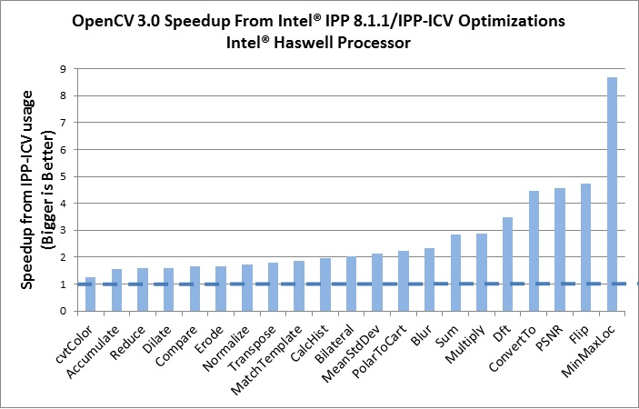

Opencv3
=======

Transparent API
---------------

The transparent OpenCV API allows application developers to automatically utilize various kinds of accelerators (GPUs, APUs, DSPs etc.) that may be available on the host platform. No or little changes to OpenCV-based applications may be needed to engage the acceleration. Starting with OpenCV 3.0, OpenCL kernels are integrated inside OpenCV API: one does not need to specify `cv::ocl::Canny`, `cv::gpu::Canny` etc; `cv::Canny` just works on both CPU and GPU. Because of that `ocl` module became redundant and was removed.
A separate guide on this topic is being prepared, but you are welcome to take a look at and try out our [Transparent API samples](https://github.com/opencv/opencv/tree/master/samples/tapi) to see how it works.

Intel®️ IPP
----------

OpenCV 3.0 supports optimization on x86 and x64 platforms with Intel® Integrated Performance Primitives ([Intel® IPP](https://software.intel.com/en-us/intel-ipp)) by using either:
a) standalone Intel® IPP that should be installed separately or
b) special subset of Intel® IPP 8.1.1 functions for image processing and computer vision, called IPPICV, that contain more than 700 functions and support AVX2, SSE4.x, SSE2 instructions sets. Intel Corporation granted OpenCV Foundation and all our users the right to use IPPICV libraries free of charge for both non-commercial and commercial use. Optimization with IPPICV is enabled by default on the supported platforms. Intel® IPP optimization (with both standalone and IPPICV libraries) is available for the following platforms:

-   Windows (32-bit and 64-bit)
-   Linux (32-bit and 64-bit)
-   Mac OS (32-bit and 64-bit)
-   Android (32-bit)

In OpenCV 3.0 Intel® IPP usage was revised and extended with new 58 family functions that should give visible performance improvement on all supported platforms and instructions sets. As an example, the overall performance gain is about 40% comparing OpenCV with and without Intel® IPP 8.1.1/IPPICV usage and running on Intel Haswell processor. Some of numbers are provided in the chart below (represented as the performance ratio of IPP-optimized function w.r.t OpenCV implementation, where 1 means no speed-up and the higher is the number - the better).

### Intel® IPP Asynchronous

OpenCV 3.0 includes support for Intel® IPP Asynchronous C/C++ library by implemented inline conversion functions between Intel® IPP Asynchronous objects (IPPhppMatrix) and OpenCV objects (cv::Mat). OpenCV tutorial contains an example demonstrating how to use conversion functions and work with Intel® IPP Asynchronous functions.

Migrating from OpenCV 2 to OpenCV 3
-----------------------------------

See the following guide: https://docs.opencv.org/master/db/dfa/tutorial_transition_guide.html
